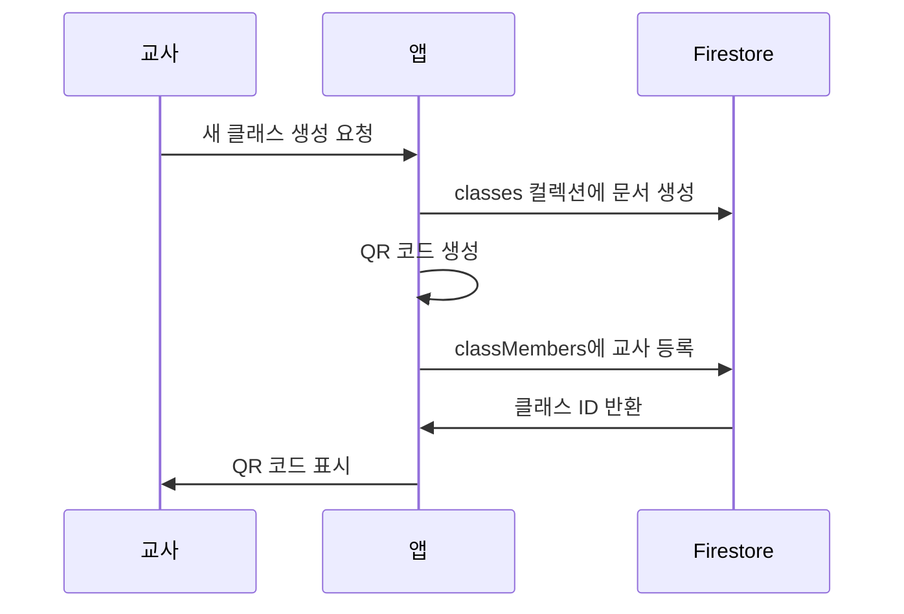
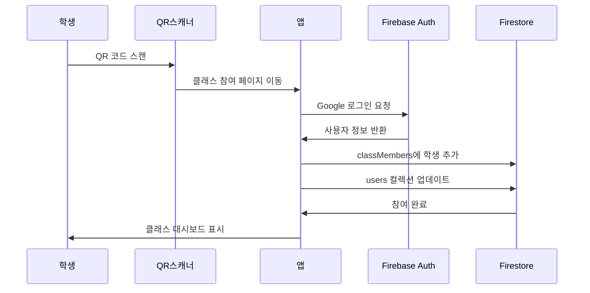

# 데이터베이스 스키마 V2 - QR 코드 기반 클래스 시스템

## 🎯 목표
교사가 클래스를 생성하고 QR 코드를 통해 학생들이 참여할 수 있는 체계적인 데이터 구조 설계

## 📊 핵심 컬렉션 구조

### 1. Users (사용자 관리)
```javascript
// users/{userId}
{
  uid: string,           // Firebase Auth UID
  email: string,         // Google 이메일
  displayName: string,   // 실명
  photoURL: string,      // 프로필 이미지
  role: 'teacher' | 'student', // 사용자 역할
  
  // 교사 전용 필드
  schoolName?: string,   // 소속 학교
  teachingSubjects?: string[], // 담당 과목
  
  // 학생 전용 필드
  grade?: string,        // 학년
  studentId?: string,    // 학번 (선택적)
  
  // 공통 필드
  points: number,        // 포인트
  level: number,         // 레벨
  badges: string[],      // 획득 배지
  
  createdAt: timestamp,
  updatedAt: timestamp
}
```

### 2. Classes (클래스 관리)
```javascript
// classes/{classId}
{
  id: string,            // 클래스 고유 ID
  className: string,     // 클래스 명
  description: string,   // 클래스 설명
  subject: string,       // 과목 (예: 'korean', 'science')
  
  teacherId: string,     // 담당 교사 UID
  teacherName: string,   // 교사 이름
  
  joinCode: string,      // 6자리 참여 코드 (기존 호환성)
  qrCode: string,        // QR 코드 데이터
  qrCodeUrl: string,     // QR 코드 이미지 URL
  
  studentCount: number,  // 현재 참여 학생 수
  maxStudents: number,   // 최대 수용 인원 (기본 50)
  
  isActive: boolean,     // 활성화 상태
  allowJoin: boolean,    // 신규 참여 허용 여부
  
  createdAt: timestamp,
  updatedAt: timestamp
}
```

### 3. ClassMembers (클래스 멤버십 관리)
```javascript
// classMembers/{classId}_{userId}
{
  classId: string,       // 클래스 ID
  userId: string,        // 사용자 UID
  userRole: 'teacher' | 'student', // 역할
  
  displayName: string,   // 표시명
  email: string,         // 이메일
  photoURL?: string,     // 프로필 이미지
  
  joinedAt: timestamp,   // 참여 일시
  lastActiveAt: timestamp, // 마지막 활동 시간
  
  // 학생 전용 통계
  totalActivities?: number,  // 총 참여 활동 수
  totalWords?: number,       // 총 작성 낱말 수
  totalSentences?: number,   // 총 작성 문장 수
  totalLikes?: number,       // 총 받은 좋아요 수
}
```

### 4. Lessons (수업 관리)
```javascript
// lessons/{lessonId}
{
  id: string,            // 수업 고유 ID
  classId: string,       // 소속 클래스 ID
  
  title: string,         // 수업 제목
  description: string,   // 수업 설명/목표
  lessonType: 'writing' | 'vocabulary' | 'discussion', // 수업 유형
  
  teacherId: string,     // 교사 UID
  teacherName: string,   // 교사 이름
  
  // 수업 상태 관리
  status: 'planned' | 'active' | 'completed' | 'archived',
  currentPhase: 'waiting' | 'images_only' | 'word_input_active' | 'sentence_input_active',
  
  // 참여자 관리
  participantCount: number,
  participants: string[], // 참여 중인 학생 UID 목록
  
  // 활동 데이터
  sharedImages?: {
    url1: string,
    alt1: string,
    url2: string,
    alt2: string,
    updatedAt: timestamp
  },
  
  createdAt: timestamp,
  startedAt?: timestamp,
  endedAt?: timestamp
}
```

### 5. LessonActivities (수업 활동 기록)
```javascript
// lessonActivities/{lessonId}/words/{wordId}
{
  id: string,
  lessonId: string,
  text: string,
  authorId: string,
  authorName: string,
  createdAt: timestamp
}

// lessonActivities/{lessonId}/sentences/{sentenceId}
{
  id: string,
  lessonId: string,
  text: string,
  authorId: string,
  authorName: string,
  likesBy: string[],     // 좋아요를 누른 사용자 UID 목록
  createdAt: timestamp
}

// lessonActivities/{lessonId}/aiHelper/{helperId}
{
  id: string,
  lessonId: string,
  content: string,       // AI 생성 콘텐츠 (JSON 문자열)
  type: 'keywords' | 'example' | 'feedback',
  createdAt: timestamp
}
```

## 🔄 핵심 플로우

### 교사 클래스 생성 플로우


### 학생 QR 참여 플로우


## 🔐 보안 규칙

```javascript
// Firestore Security Rules
rules_version = '2';
service cloud.firestore {
  match /databases/{database}/documents {
    // 사용자는 자신의 문서만 읽기/쓰기 가능
    match /users/{userId} {
      allow read, write: if request.auth != null && request.auth.uid == userId;
    }
    
    // 클래스는 교사만 생성/수정, 멤버는 읽기 가능
    match /classes/{classId} {
      allow read: if request.auth != null;
      allow create, update, delete: if request.auth != null && 
        (request.auth.uid == resource.data.teacherId || 
         request.auth.uid == request.resource.data.teacherId);
    }
    
    // 클래스 멤버십은 해당 클래스 구성원만 접근
    match /classMembers/{membershipId} {
      allow read, write: if request.auth != null && 
        exists(/databases/$(database)/documents/classMembers/$(membershipId.split('_')[0])_$(request.auth.uid));
    }
    
    // 수업은 해당 클래스 교사만 관리, 학생은 읽기만
    match /lessons/{lessonId} {
      allow read: if request.auth != null;
      allow create, update, delete: if request.auth != null && 
        request.auth.uid == resource.data.teacherId;
    }
    
    // 수업 활동은 참여자만 접근
    match /lessonActivities/{lessonId}/{type}/{activityId} {
      allow read, write: if request.auth != null;
    }
  }
}
```

## 📱 URL 구조

### QR 코드 URL 형식
```
https://improvewritingapp.web.app/join/{classId}
```

### 주요 페이지 라우트
```
/                          # 홈페이지 (역할별 자동 리다이렉션)
/login                     # 로그인 페이지
/dashboard                 # 교사 대시보드
/classes/{classId}         # 클래스 관리 (교사용)
/lessons/{lessonId}        # 수업 활동 (교사/학생 공용)
/student/classes           # 학생 클래스 목록
/student/portfolio/{userId} # 학생 포트폴리오
/join/{classId}           # QR 코드 참여 페이지
/scan                     # QR 스캐너 페이지
```

## 🚀 구현 우선순위

1. **클래스 생성 시 QR 코드 자동 생성**
2. **QR 참여 페이지 (`/join/{classId}`) 구현**
3. **사용자 역할별 홈페이지 라우팅**
4. **교사 클래스 관리 개선**
5. **수업(Lesson) 시스템 구축**
6. **QR 스캐너 기능 추가**