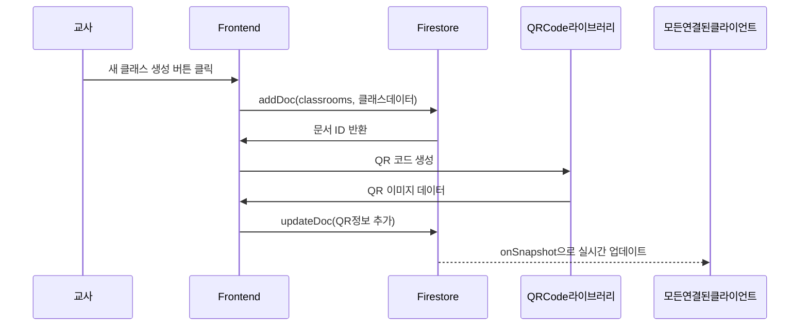

# Firebase 아키텍처 가이드 문서

## 📋 문서 개요

이 문서는 **상상력을 펼치는 글쓰기 V2** 프로젝트의 Firebase 백엔드 아키텍처에 대한 상세한 가이드입니다. 프로젝트가 어떻게 Firebase 서비스들을 활용하여 실시간 교육 플랫폼을 구현하는지 설명합니다.

---

## 🎯 Firebase란 무엇인가?

**Firebase는 구글이 제공하는 백엔드 서비스 플랫폼**입니다. 복잡한 서버 구축 없이도 다음과 같은 기능들을 제공받을 수 있습니다:

- **데이터베이스**: 실시간으로 동기화되는 NoSQL 데이터베이스
- **인증**: 사용자 로그인 및 회원관리 
- **호스팅**: 웹사이트 배포 및 서빙
- **Storage**: 파일 업로드 및 저장

### 왜 Firebase를 선택했나요?

1. **실시간 협업**: 교사와 학생 간 실시간 상호작용이 필요한 교육 플랫폼
2. **빠른 개발**: 복잡한 백엔드 구축 없이 핵심 교육 기능에 집중 가능
3. **확장성**: 학급 수가 증가해도 자동으로 확장되는 인프라
4. **보안**: 구글의 보안 인프라를 활용한 안전한 데이터 관리

---

## 🏗️ Firebase 서비스 구성

### 1. Firebase 초기화 (src/lib/firebase/firebase.ts)

```typescript
// Firebase v9+ SDK 초기화
import { initializeApp } from 'firebase/app';
import { getAuth } from 'firebase/auth';
import { getFirestore } from 'firebase/firestore';
import { getFunctions } from 'firebase/functions';
import { getStorage } from 'firebase/storage';
import { getAnalytics } from 'firebase/analytics';

// Firebase 앱 초기화
export const app = initializeApp(firebaseConfig);

// Firebase 서비스들
export const auth = getAuth(app);        // 인증
export const db = getFirestore(app);     // 데이터베이스  
export const functions = getFunctions(app); // 클라우드 함수
export const storage = getStorage(app);  // 파일 저장소
export let analytics = getAnalytics(app); // 분석
```

**Q: 왜 이렇게 많은 서비스가 필요한가요?**

각 서비스는 다음과 같은 역할을 담당합니다:
- `auth`: 교사/학생 구분 및 로그인 관리
- `db`: 클래스, 수업, 학생 데이터 저장 및 실시간 동기화
- `functions`: 서버 로직 (AI 기능, 복잡한 데이터 처리)
- `storage`: 수업 자료, 학생 작품 파일 저장
- `analytics`: 사용 통계 및 개선사항 파악

### 2. 설정 파일 구조

- `config.template.ts`: 설정 파일 템플릿 (공개)
- `config.ts`: 실제 Firebase 프로젝트 정보 (비공개, .gitignore에 포함)

**Q: 왜 설정을 분리했나요?**
- 보안: 실제 Firebase 프로젝트 키가 GitHub에 노출되는 것을 방지
- 협업: 개발자마다 다른 Firebase 프로젝트를 사용할 수 있음
- 환경 분리: 개발/테스트/프로덕션 환경을 분리 가능

---

## 🔐 인증 시스템 (Authentication)

### 1. 이중 인증 구조

프로젝트는 **교사와 학생을 위한 서로 다른 인증 방식**을 사용합니다:

#### 교사 인증: Google OAuth
```typescript
async function handleGoogleLogin() {
  const provider = new GoogleAuthProvider();
  const result = await signInWithPopup(auth, provider);
  
  // 교사 정보를 Firestore에 저장
  await setDoc(doc(db, 'users', result.user.uid), {
    role: 'teacher', // 핵심: 역할 구분
    email: result.user.email,
    displayName: result.user.displayName,
    // ... 기타 정보
  });
}
```

#### 학생 인증: Google OAuth + 참여 코드
```typescript
async function handleStudentGoogleLogin() {
  const provider = new GoogleAuthProvider();
  const result = await signInWithPopup(auth, provider);
  
  // 학생이 이미 클래스에 참여했는지 확인
  const membershipQuery = query(
    collection(db, 'classMembers'), 
    where('userId', '==', result.user.uid)
  );
  
  // 참여한 클래스가 없으면 참여 코드 입력 요청
}
```

**Q: 왜 학생도 Google 로그인을 사용하나요?**
1. **일관성**: 교사와 동일한 인증 방식으로 안전성 확보
2. **개인화**: 학생별 학습 기록 및 포트폴리오 관리
3. **편의성**: 별도 회원가입 없이 Google 계정으로 간편 로그인

### 2. 역할 기반 접근 제어

```typescript
// 사용자 문서 구조
{
  uid: "user123",
  email: "teacher@school.com",
  role: "teacher" | "student",  // 핵심 구분자
  displayName: "김선생님",
  points: 0,     // 게임화 요소
  level: 1,      // 게임화 요소
  createdAt: timestamp,
  lastLogin: timestamp
}
```

**데이터 흐름:**
1. 사용자 로그인 → Firebase Auth에서 인증
2. 인증 성공 → Firestore 'users' 컬렉션에서 역할 확인  
3. 역할에 따라 적절한 페이지로 리디렉션
   - 교사: `/dashboard` (클래스 관리)
   - 학생: `/student/classes` (참여 클래스 목록)

---

## 🗄️ 데이터베이스 구조 (Firestore)

### 1. 주요 컬렉션 구조

```
📁 Firestore Database
├── 👥 users (사용자 정보)
├── 🏫 classrooms (클래스 정보)
├── 🤝 classMembers (클래스 참여 관계)
├── 📚 lessons (수업/레슨 정보)
└── 📊 lessons/{lessonId}/subcollections (수업별 세부 데이터)
    ├── sharedImages (공유 이미지)
    ├── words (단어 활동)
    ├── sentences (문장 활동)
    ├── aiHelper (AI 도우미 대화)
    └── participants (참여자 기록)
```

### 2. classrooms 컬렉션 (클래스 정보)

```typescript
{
  id: "classroom123",           // Firestore 자동생성 ID
  className: "3학년 1반",       // 클래스명
  teacherId: "teacher_uid",     // 담당교사 UID
  teacherName: "김선생님",      // 교사 이름 (중복저장으로 성능 최적화)
  joinCode: "ABC123",          // 6자리 참여 코드
  studentCount: 25,            // 참여 학생 수 (실시간 업데이트)
  maxStudents: 50,             // 최대 참여 가능 학생 수
  isActive: true,              // 활성화 상태
  allowJoin: true,             // 신규 참여 허용 여부
  createdAt: timestamp,        // 생성일
  qrCode: "https://...",       // QR 코드 URL
  qrCodeUrl: "data:image/png..." // QR 코드 이미지 데이터
}
```

**Q: 왜 teacherName을 중복 저장하나요?**
- **성능 최적화**: 클래스 목록을 보여줄 때마다 users 컬렉션을 조회할 필요 없음
- **UI 응답성**: 화면 렌더링이 빨라짐
- **비용 절약**: Firestore 읽기 요청 수 감소

### 3. classMembers 컬렉션 (참여 관계)

```typescript
{
  id: "member123",
  classId: "classroom123",      // 어떤 클래스에
  userId: "student_uid",        // 어떤 학생이
  studentName: "이학생",        // 학생 이름 (중복저장)
  studentEmail: "student@gmail.com",
  joinedAt: timestamp,          // 참여일
  isActive: true               // 활성 참여 상태
}
```

**Q: 왜 별도 컬렉션으로 관리하나요?**
- **유연한 관계 관리**: 학생이 여러 클래스에 참여 가능
- **효율적 쿼리**: 특정 학생의 모든 클래스나 특정 클래스의 모든 학생을 쉽게 조회
- **확장성**: 추후 권한 관리나 역할 세분화 시 활용 가능

### 4. lessons 컬렉션 (수업 정보)

```typescript
{
  id: "lesson123",
  classId: "classroom123",      // 소속 클래스
  title: "봄에 대한 창의적 글쓰기",
  description: "봄을 주제로 한 상상력 글쓰기 수업",
  type: "creative_writing",     // 수업 유형
  status: "active",            // active, completed, draft
  createdAt: timestamp,
  updatedAt: timestamp
}
```

**수업 유형 (type) 분류:**
- `creative_writing`: 창의적 글쓰기
- `vocabulary_game`: 단어/어휘 게임
- `discussion`: 토론 활동

---

## ⚡ 실시간 데이터 동기화

### 1. onSnapshot을 통한 실시간 리스너

```typescript
// 클래스룸 목록 실시간 구독
function loadClassrooms() {
  const classroomsRef = collection(db, 'classrooms');
  const q = query(classroomsRef, where('teacherId', '==', user.uid));
  
  onSnapshot(q, (snapshot) => {
    classrooms = snapshot.docs.map(doc => ({
      id: doc.id,
      ...doc.data()
    }));
    // UI가 자동으로 업데이트됨 (Svelte의 반응성)
  });
}
```

**실시간 동기화의 장점:**
1. **즉시 반영**: 데이터 변경이 모든 연결된 클라이언트에 즉시 반영
2. **협업**: 교사가 수업을 만들면 학생 화면에서도 실시간으로 확인 가능
3. **일관성**: 모든 사용자가 항상 최신 상태의 데이터를 보게 됨

### 2. 데이터 흐름 예시: 클래스 생성



**Q: 왜 QR 코드를 별도로 업데이트하나요?**
- **브라우저 환경**: QR 코드 생성은 클라이언트에서만 가능
- **실제 URL**: Firestore Document ID가 생성된 후에야 정확한 URL 생성 가능
- **성능**: QR 코드 생성은 시간이 걸리므로 비동기 처리

---

## 🔍 쿼리 최적화 및 성능

### 1. 복합 인덱스 처리

```typescript
// 이상적인 쿼리 (인덱스 필요)
const lessonsQuery = query(
  lessonsRef, 
  where('classId', '==', classData.id), 
  orderBy('createdAt', 'desc')
);

// 폴백 쿼리 (인덱스 없이도 작동)
const simpleLessonsQuery = query(
  lessonsRef, 
  where('classId', '==', classData.id)
);
// 클라이언트에서 정렬
lessons.sort((a, b) => b.createdAt - a.createdAt);
```

**Q: 왜 두 가지 쿼리 방식을 사용하나요?**
- **안정성**: Firebase 인덱스 생성이 지연되는 경우 대비
- **개발 속도**: 개발 초기에는 간단한 쿼리로 빠른 프로토타이핑
- **사용자 경험**: 인덱스 문제로 앱이 중단되는 것을 방지

### 2. 데이터 중복 저장 전략

```typescript
// 클래스 정보에 교사명 중복 저장
{
  className: "3학년 1반",
  teacherId: "teacher123",
  teacherName: "김선생님",    // users 컬렉션에도 있지만 중복 저장
}

// 멤버 정보에 학생명 중복 저장  
{
  classId: "class123",
  userId: "student456", 
  studentName: "이학생",      // users 컬렉션에도 있지만 중복 저장
}
```

**NoSQL 데이터베이스의 특징:**
- **비정규화**: 관계형 DB와 달리 중복 저장을 통한 성능 최적화
- **읽기 최적화**: 조인 없이 한 번의 쿼리로 필요한 모든 정보 획득
- **트레이드오프**: 저장공간 vs 성능 (교육용 앱에서는 성능이 더 중요)

---

## 🚀 확장성 고려사항

### 1. 컬렉션 분할 전략

현재는 단순한 구조이지만, 향후 확장을 위한 설계:

```typescript
// 현재: 모든 수업이 하나의 컬렉션
lessons/
├── lesson1 (classId: class1)
├── lesson2 (classId: class1) 
├── lesson3 (classId: class2)
└── ...

// 확장 시: 클래스별로 서브컬렉션 분할 가능
classrooms/
├── class1/
│   └── lessons/
│       ├── lesson1
│       └── lesson2
└── class2/
    └── lessons/
        └── lesson3
```

### 2. 캐싱 및 성능 최적화

```typescript
// 전역 상태로 자주 사용되는 데이터 캐싱
let allExperiments = []; // 전체 실험 데이터 저장

onSnapshot(experimentsQuery, (snapshot) => {
  allExperiments = snapshot.docs.map(doc => ({...}));
  // 필터링은 캐시된 데이터로 처리
});
```

**Q: 실시간 업데이트와 캐싱을 동시에 어떻게 하나요?**
- **onSnapshot**: 실시간으로 캐시 업데이트
- **메모리 캐싱**: 필터링/정렬은 메모리에서 처리
- **효율성**: 서버 요청 최소화 + 빠른 UI 반응

---

## 🛡️ 보안 및 권한 관리

### 1. 클라이언트 사이드 권한 체크

```typescript
// 교사만 클래스 생성 가능
if (user && user.role === 'teacher') {
  // 클래스 생성 로직
}

// 클래스 소유자만 수정 가능
if (classData.teacherId === user.uid) {
  // 수정 권한 있음
}
```

### 2. Firebase Security Rules (향후 적용 예정)

```javascript
// firestore.rules 예시
rules_version = '2';
service cloud.firestore {
  match /databases/{database}/documents {
    // 교사만 자신의 클래스 생성/수정 가능
    match /classrooms/{classId} {
      allow read, write: if request.auth != null 
        && request.auth.uid == resource.data.teacherId;
    }
    
    // 클래스 멤버만 수업 참여 가능  
    match /lessons/{lessonId} {
      allow read: if request.auth != null 
        && exists(/databases/$(database)/documents/classMembers/$(request.auth.uid + '_' + resource.data.classId));
    }
  }
}
```

---

## ⚠️ 주의사항 및 베스트 프랙티스

### 1. 비용 관리

- **읽기 요청 최적화**: 불필요한 실시간 리스너 정리
- **쓰기 요청 최적화**: 배치 작업 활용
- **대용량 데이터**: Storage 활용으로 Firestore 문서 크기 제한 준수

### 2. 에러 처리

```typescript
try {
  const result = await addDoc(collection(db, 'classrooms'), data);
} catch (error) {
  console.error('Firebase error:', error);
  // 사용자에게 친화적인 에러 메시지 표시
  alert('클래스 생성에 실패했습니다. 다시 시도해주세요.');
}
```

### 3. 오프라인 지원

Firebase는 기본적으로 오프라인 캐싱을 지원하지만, 교육용 앱의 특성상 실시간 협업이 중요하므로 온라인 상태 확인이 필요할 수 있습니다.

---

## 📈 모니터링 및 분석

### 1. Firebase Analytics

```typescript
// 브라우저에서만 Analytics 초기화
if (typeof window !== 'undefined') {
  isSupported().then(supported => {
    if (supported) {
      analytics = getAnalytics(app);
    }
  });
}
```

**추적 가능한 지표:**
- 클래스 생성 수
- 학생 참여율  
- 수업별 활동량
- 기능 사용 패턴

### 2. 성능 모니터링

Firebase Performance Monitoring을 통해 다음을 추적할 수 있습니다:
- 페이지 로딩 시간
- 데이터베이스 쿼리 성능
- 네트워크 요청 지연시간

---

## 🔄 데이터 마이그레이션 및 백업

### 1. 데이터 구조 변경 시 고려사항

- **하위 호환성**: 기존 데이터 구조와 새 구조 동시 지원
- **점진적 마이그레이션**: 한 번에 모든 데이터를 변경하지 않고 점진적으로 업데이트
- **백업**: 중요한 변경 전 데이터 백업 필수

### 2. 삭제 정책

현재 구현된 cascade delete 패턴:
```typescript
// 클래스 삭제 시 모든 관련 데이터 삭제
- 클래스의 모든 수업(lessons)
- 수업별 모든 활동 데이터 (서브컬렉션)
- 클래스 멤버 관계 (classMembers)
- 클래스 관련 파일들 (향후 Storage 연동 시)
```

---

## 📚 추가 학습 자료

1. **Firebase 공식 문서**: https://firebase.google.com/docs
2. **Firestore 데이터 모델링**: https://firebase.google.com/docs/firestore/data-model
3. **Firebase Security Rules**: https://firebase.google.com/docs/rules
4. **성능 최적화 가이드**: https://firebase.google.com/docs/firestore/best-practices

---

**이 가이드는 프로젝트의 Firebase 아키텍처를 이해하고 관리하는 데 도움이 되도록 작성되었습니다. 추가 질문이나 새로운 기능 구현 시 이 문서를 참조하여 일관된 구조를 유지해주세요.**