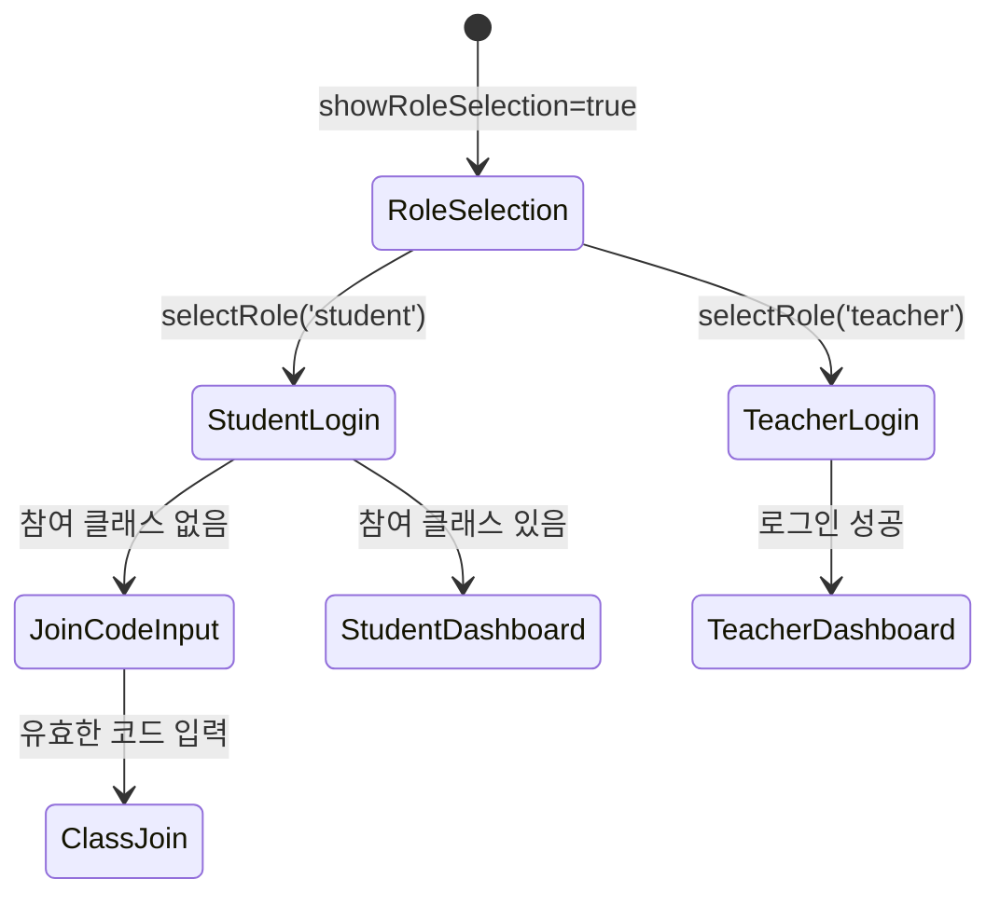

# Svelte 컴포넌트 아키텍처 가이드 문서

## 📋 문서 개요

이 문서는 **상상력을 펼치는 글쓰기 V2** 프로젝트의 Svelte 컴포넌트 아키텍처를 상세히 설명합니다. 각 컴포넌트의 역할, 데이터 흐름, 상태 관리 방식, 그리고 컴포넌트 간 통신 방법을 비전문가도 이해할 수 있도록 설명합니다.

---

## 🎯 Svelte와 SvelteKit이란?

**Svelte**는 컴파일 타임에 최적화되는 현대적인 프론트엔드 프레임워크입니다. **SvelteKit**은 Svelte 기반의 풀스택 웹 애플리케이션 프레임워크입니다.

### 왜 Svelte를 선택했나요?

1. **반응성**: 데이터가 변경되면 UI가 자동으로 업데이트
2. **성능**: 컴파일 타임 최적화로 빠른 실행 속도
3. **직관적인 문법**: HTML, CSS, JavaScript를 자연스럽게 조합
4. **작은 번들 크기**: 교육용 앱에서 중요한 빠른 로딩

---

## 🏗️ 전체 컴포넌트 구조

```
📁 src/
├── 🗂️ routes/ (SvelteKit 페이지)
│   ├── +layout.svelte       # 전역 레이아웃
│   ├── +page.svelte         # 메인 페이지 (라우팅 허브)
│   └── dashboard/
│       └── +page.svelte     # 대시보드 래퍼
│
├── 🧩 lib/components/ (재사용 가능한 컴포넌트)
│   ├── Login.svelte         # 로그인/역할 선택
│   ├── Dashboard.svelte     # 교사 대시보드
│   ├── ClassManagement.svelte # 클래스 관리
│   ├── StudentView.svelte   # 학생 뷰
│   └── PointsSystem.svelte  # 포인트 시스템
│
└── 🔥 lib/firebase/
    └── firebase.ts          # Firebase 설정
```

**Q: routes와 components 폴더의 차이는 무엇인가요?**
- **routes**: URL 경로와 직접 연결되는 페이지 컴포넌트
- **components**: 여러 페이지에서 재사용할 수 있는 독립적인 컴포넌트

---

## 🚪 라우팅 시스템 (routes/)

### 1. 전역 레이아웃 (+layout.svelte)

```typescript
// src/routes/+layout.svelte
<script lang="ts">
  import favicon from '$lib/assets/favicon.svg';
</script>

<svelte:head>
  <link rel="icon" href={favicon} />
</svelte:head>

<slot></slot>  <!-- 하위 페이지가 여기에 렌더링됨 -->
```

**역할:**
- 모든 페이지에 공통으로 적용되는 기본 레이아웃
- favicon 설정
- 향후 네비게이션 바나 푸터를 추가할 때 사용

**Q: `<slot>`이란 무엇인가요?**
- 하위 컴포넌트가 렌더링될 위치를 지정하는 Svelte의 특별한 요소
- React의 `{children}`과 유사한 개념

### 2. 메인 라우팅 허브 (+page.svelte)

```typescript
// src/routes/+page.svelte - 핵심 라우팅 로직
onMount(() => {
  return auth.onAuthStateChanged(async (currentUser) => {
    if (currentUser) {
      // 사용자 역할 확인
      const userRole = await getUserRole(currentUser.uid);
      
      // 역할별 리디렉션
      if (userRole === 'teacher') {
        goto('/dashboard');
      } else if (userRole === 'student') {
        goto('/student/classes');
      }
    }
    isLoading = false;
  });
});
```

**핵심 기능:**
1. **인증 상태 감지**: Firebase Auth 변경사항 실시간 추적
2. **역할 기반 라우팅**: 교사/학생 구분하여 적절한 페이지로 이동
3. **로딩 상태 관리**: 인증 확인 중 로딩 화면 표시
4. **컴포넌트 선택**: 인증 상태에 따라 Login 또는 Dashboard 컴포넌트 렌더링

**데이터 흐름:**
```mermaid
flowchart TD
    A[페이지 로드] --> B[onMount 실행]
    B --> C[auth.onAuthStateChanged 리스너 등록]
    C --> D{사용자 인증됨?}
    D -->|Yes| E[Firestore에서 사용자 역할 조회]
    D -->|No| F[Login 컴포넌트 렌더링]
    E --> G{역할 확인}
    G -->|teacher| H[/dashboard로 이동]
    G -->|student| I[/student/classes로 이동]
    G -->|역할 없음| J[기본 교사로 처리]
```

### 3. 대시보드 래퍼 (dashboard/+page.svelte)

```typescript
// src/routes/dashboard/+page.svelte
<script lang="ts">
  import Dashboard from '$lib/components/Dashboard.svelte';
  
  onMount(() => {
    const unsubscribe = auth.onAuthStateChanged((user) => {
      if (!user) {
        goto('/');  // 로그인되지 않으면 홈으로
      }
    });
    return unsubscribe;
  });
</script>

<Dashboard />
```

**Q: 왜 별도의 래퍼 페이지가 필요한가요?**
- **URL 접근성**: `/dashboard` 경로로 직접 접근 가능
- **권한 검증**: 페이지 레벨에서 인증 상태 재확인
- **SEO**: 검색 엔진이 페이지를 개별적으로 인식
- **북마크**: 사용자가 특정 페이지를 북마크 가능

---

## 🧩 핵심 컴포넌트 분석

### 1. Login 컴포넌트 - 인증 관리자

```typescript
// src/lib/components/Login.svelte - 상태 관리
let selectedRole = '';        // 'teacher' | 'student'
let showRoleSelection = true; // 역할 선택 화면 표시 여부
let showJoinCodeInput = false; // 참여 코드 입력 화면 표시 여부
let joinCode = '';           // 입력된 참여 코드
let isLoading = false;       // 로딩 상태
let errorMessage = '';       // 에러 메시지
```

**핵심 기능들:**

#### A. 역할별 인증 흐름
```typescript
// 교사 인증: 단순 Google OAuth
async function handleGoogleLogin() {
  const result = await signInWithPopup(auth, provider);
  
  await setDoc(doc(db, 'users', result.user.uid), {
    role: 'teacher',
    // ... 기타 정보
  });
  
  window.location.href = '/dashboard';
}

// 학생 인증: Google OAuth + 클래스 참여 확인
async function handleStudentGoogleLogin() {
  const result = await signInWithPopup(auth, provider);
  
  // 기존 클래스 참여 이력 확인
  const membershipQuery = query(
    collection(db, 'classMembers'), 
    where('userId', '==', result.user.uid)
  );
  
  if (membershipSnapshot.empty) {
    showJoinCodeInput = true;  // 참여 코드 입력 요청
  } else {
    window.location.href = '/student/classes';
  }
}
```

#### B. 상태 기반 UI 렌더링
```svelte
{#if showRoleSelection}
  <!-- 역할 선택 화면 -->
{:else if selectedRole === 'student'}
  {#if !showJoinCodeInput}
    <!-- 학생 Google 로그인 화면 -->
  {:else}
    <!-- 참여 코드 입력 화면 -->
  {/if}
{:else if selectedRole === 'teacher'}
  <!-- 교사 Google 로그인 화면 -->
{/if}
```

**Q: 왜 이렇게 복잡한 상태 관리가 필요한가요?**
- **사용자 경험**: 단계별로 명확한 안내
- **보안**: 학생은 반드시 유효한 클래스에 참여해야 함
- **유연성**: 향후 익명 로그인 등 다양한 인증 방식 추가 가능

### 2. Dashboard 컴포넌트 - 교사 작업 공간

```typescript
// src/lib/components/Dashboard.svelte - 상태 관리
let user: any = null;           // 현재 사용자 정보
let classrooms: any[] = [];     // 교사의 클래스 목록
let newClassName = '';          // 새 클래스명 입력
let isLoading = false;          // 작업 진행 상태
let showQRModal = false;        // QR 코드 모달 표시 상태
let selectedClass: any = null;  // 선택된 클래스 (QR 모달용)
let qrCodeDataUrl = '';        // 생성된 QR 코드 이미지
```

#### A. 실시간 데이터 구독
```typescript
function loadClassrooms() {
  const classroomsRef = collection(db, 'classrooms');
  const q = query(classroomsRef, where('teacherId', '==', user.uid));
  
  onSnapshot(q, (snapshot) => {
    classrooms = snapshot.docs.map(doc => ({
      id: doc.id,
      ...doc.data()
    }));
    // Svelte의 반응성으로 UI 자동 업데이트
  });
}
```

**Svelte 반응성의 특징:**
- `classrooms` 배열이 변경되면 연결된 모든 UI가 자동 업데이트
- `$:` 반응형 구문으로 파생된 값들도 자동 계산
- onSnapshot과 Svelte 반응성의 완벽한 조합

#### B. 클래스 생성 워크플로우
```typescript
async function createClass() {
  // 1. 기본 클래스 정보로 Firestore 문서 생성
  const docRef = await addDoc(collection(db, 'classrooms'), {
    className: newClassName.trim(),
    teacherId: user.uid,
    joinCode: generateJoinCode(),
    // ... 기타 필드
  });
  
  // 2. 생성된 문서 ID로 QR 코드 생성
  const qrUrl = `${window.location.origin}/join/${docRef.id}`;
  const qrCodeDataUrl = await QRCode.toDataURL(qrUrl);
  
  // 3. QR 코드 정보를 문서에 업데이트
  await updateDoc(docRef, {
    qrCode: qrUrl,
    qrCodeUrl: qrCodeDataUrl
  });
}
```

**Q: 왜 두 번에 나누어 저장하나요?**
- **Document ID 필요성**: QR 코드 생성에는 실제 생성된 문서 ID가 필요
- **브라우저 처리**: QR 코드 생성은 클라이언트에서만 가능
- **사용자 경험**: 클래스는 먼저 생성되고, QR 코드는 백그라운드에서 처리

#### C. 복합 삭제 로직
```typescript
async function deleteClass(classId: string) {
  // 1. 클래스의 모든 수업(lessons) 조회 및 삭제
  const lessonsSnapshot = await getDocs(
    query(collection(db, 'lessons'), where('classId', '==', classId))
  );
  
  // 2. 각 수업의 서브컬렉션들 삭제
  for (const lessonDoc of lessonsSnapshot.docs) {
    const subCollections = ['sharedImages', 'words', 'sentences', 'aiHelper'];
    for (const subCollection of subCollections) {
      // 서브컬렉션의 모든 문서 삭제
    }
  }
  
  // 3. 클래스 멤버 관계 삭제
  // 4. 마지막으로 클래스 문서 자체 삭제
}
```

**cascading delete의 중요성:**
- **데이터 정합성**: 관련된 모든 데이터를 일관되게 정리
- **저장 공간**: 불필요한 데이터 누적 방지  
- **성능**: 고아 데이터(orphan data) 방지로 쿼리 성능 유지

### 3. ClassManagement 컴포넌트 - 수업 관리자

```typescript
// src/lib/components/ClassManagement.svelte
export let classData: any;  // 상위 컴포넌트에서 전달받은 클래스 정보

let lessons: any[] = [];           // 수업 목록
let showCreateForm = false;        // 수업 생성 폼 표시 여부
let newLessonTitle = '';          // 새 수업 제목
let newLessonDescription = '';    // 새 수업 설명  
let newLessonType = 'creative_writing'; // 수업 유형
```

#### A. props를 통한 데이터 전달
```typescript
// 상위 컴포넌트에서
<ClassManagement classData={selectedClass} />

// ClassManagement 내에서
export let classData: any;  // props 선언
```

**컴포넌트 간 데이터 전달 방식:**
- **props down**: 상위에서 하위로 데이터 전달
- **events up**: 하위에서 상위로 이벤트 발생
- **stores**: 전역 상태 관리 (현재 미사용, Firebase가 그 역할)

#### B. 폴백 쿼리 패턴
```typescript
function setupLessonListener() {
  try {
    // 이상적인 쿼리 (복합 인덱스 필요)
    const lessonsQuery = query(
      lessonsRef, 
      where('classId', '==', classData.id), 
      orderBy('createdAt', 'desc')
    );
    
    onSnapshot(lessonsQuery, handleSnapshot, (error) => {
      if (error.code === 'failed-precondition') {
        useSimpleLessonQuery();  // 폴백 실행
      }
    });
  } catch (error) {
    useSimpleLessonQuery();
  }
}

function useSimpleLessonQuery() {
  // 인덱스 없이도 작동하는 간단한 쿼리
  const lessonsQuery = query(lessonsRef, where('classId', '==', classData.id));
  
  onSnapshot(lessonsQuery, (snapshot) => {
    lessons = snapshot.docs
      .map(doc => ({ id: doc.id, ...doc.data() }))
      .sort((a, b) => b.createdAt - a.createdAt); // 클라이언트에서 정렬
  });
}
```

**Q: 왜 이런 복잡한 패턴을 사용하나요?**
- **개발 안정성**: Firebase 인덱스 생성 지연에 대비
- **사용자 경험**: 앱이 중단되지 않고 계속 동작
- **점진적 최적화**: 인덱스가 준비되면 자동으로 최적화된 쿼리 사용

---

## 🔄 상태 관리 패턴

### 1. 로컬 상태 관리

```typescript
// 컴포넌트 내부 상태
let isLoading = false;     // boolean 상태
let items: any[] = [];     // 배열 상태  
let currentUser = null;    // 객체 상태

// 반응형 파생 상태
$: itemCount = items.length;
$: hasItems = items.length > 0;
$: loadingText = isLoading ? '로딩 중...' : '완료';
```

**Svelte 반응성 시스템:**
- `let` 선언된 변수는 자동으로 반응형
- `$:` 구문으로 파생된 값 자동 계산
- 변수가 변경되면 관련된 DOM이 자동 업데이트

### 2. 생명주기 관리

```typescript
import { onMount, onDestroy } from 'svelte';

let unsubscribes: Function[] = [];

onMount(() => {
  // Firebase 리스너 등록
  const unsubscribe = onSnapshot(query, callback);
  unsubscribes.push(unsubscribe);
});

onDestroy(() => {
  // 메모리 누수 방지를 위한 리스너 정리
  unsubscribes.forEach(unsubscribe => unsubscribe());
});
```

**Q: 왜 리스너 정리가 중요한가요?**
- **메모리 누수 방지**: 컴포넌트가 제거되어도 리스너가 계속 실행될 수 있음
- **성능**: 불필요한 네트워크 요청 방지
- **배터리**: 모바일에서 배터리 사용량 최적화

### 3. 에러 상태 관리

```typescript
let errorMessage = '';
let isLoading = false;

async function handleAsyncOperation() {
  try {
    isLoading = true;
    errorMessage = '';  // 이전 에러 초기화
    
    await someAsyncOperation();
    
  } catch (error) {
    errorMessage = '작업에 실패했습니다. 다시 시도해주세요.';
    console.error('Operation failed:', error);
  } finally {
    isLoading = false;
  }
}

// 에러 메시지 자동 삭제
$: if (errorMessage) {
  setTimeout(() => errorMessage = '', 3000);
}
```

---

## 🎨 UI 상태와 조건부 렌더링

### 1. 다단계 UI 상태 관리

```svelte
<!-- Login 컴포넌트의 복잡한 조건부 렌더링 -->
{#if showRoleSelection}
  <!-- 1단계: 역할 선택 -->
  <div class="role-selection">
    <button on:click={() => selectRole('student')}>학생</button>
    <button on:click={() => selectRole('teacher')}>교사</button>
  </div>

{:else if selectedRole === 'student'}
  {#if !showJoinCodeInput}
    <!-- 2-A단계: 학생 Google 로그인 -->
    <StudentGoogleLogin />
  {:else}
    <!-- 2-B단계: 참여 코드 입력 -->
    <JoinCodeInput />
  {/if}

{:else if selectedRole === 'teacher'}
  <!-- 2-C단계: 교사 Google 로그인 -->
  <TeacherGoogleLogin />
{/if}
```

**상태 전환 흐름:**


### 2. 로딩 상태 패턴

```svelte
<!-- 버튼 상태 관리 -->
<button 
  on:click={handleSubmit}
  disabled={isLoading || !isValid}
  class="btn {isLoading ? 'btn-loading' : 'btn-normal'}"
>
  {#if isLoading}
    <div class="spinner"></div>
    처리 중...
  {:else}
    완료
  {/if}
</button>

<!-- 리스트 로딩 상태 -->
{#if isLoading}
  <div class="loading-placeholder">
    데이터를 불러오는 중입니다...
  </div>
{:else if items.length === 0}
  <div class="empty-state">
    아직 항목이 없습니다.
  </div>
{:else}
  {#each items as item}
    <ItemComponent {item} />
  {/each}
{/if}
```

### 3. 모달 상태 관리

```typescript
// Dashboard 컴포넌트의 QR 모달
let showQRModal = false;
let selectedClass: any = null;

function showQRCode(classroom: any) {
  selectedClass = classroom;
  showQRModal = true;
}

function closeQRModal() {
  showQRModal = false;
  selectedClass = null;
}
```

```svelte
<!-- 모달 렌더링 -->
{#if showQRModal && selectedClass}
  <div class="modal-backdrop" on:click={closeQRModal}>
    <div class="modal-content" on:click|stopPropagation>
      <h3>{selectedClass.className}</h3>
      
      <button on:click={closeQRModal}>닫기</button>
    </div>
  </div>
{/if}
```

**Q: `on:click|stopPropagation`은 왜 사용하나요?**
- **이벤트 버블링 방지**: 모달 내용 클릭 시 배경 클릭 이벤트가 실행되지 않음
- **사용자 경험**: 실수로 모달이 닫히는 것을 방지

---

## 🔗 컴포넌트 간 통신

### 1. Props로 데이터 전달 (부모 → 자식)

```svelte
<!-- 부모 컴포넌트 -->
<script>
  let selectedClassroom = null;
</script>

<ClassManagement classData={selectedClassroom} />
```

```svelte
<!-- 자식 컴포넌트 (ClassManagement) -->
<script>
  export let classData;  // props 선언
  
  // classData 변경 감지
  $: if (classData) {
    loadLessons(classData.id);
  }
</script>
```

### 2. 이벤트로 상태 전달 (자식 → 부모)

```svelte
<!-- 자식 컴포넌트 -->
<script>
  import { createEventDispatcher } from 'svelte';
  
  const dispatch = createEventDispatcher();
  
  function handleComplete(result) {
    dispatch('complete', {
      result: result,
      timestamp: new Date()
    });
  }
</script>

<button on:click={() => handleComplete('success')}>
  완료
</button>
```

```svelte
<!-- 부모 컴포넌트 -->
<ChildComponent on:complete={handleChildComplete} />

<script>
  function handleChildComplete(event) {
    console.log('Child completed:', event.detail);
    // event.detail = { result: 'success', timestamp: ... }
  }
</script>
```

### 3. Firebase를 통한 전역 상태 공유

현재 프로젝트에서는 Svelte Store 대신 Firebase를 전역 상태 관리자로 활용:

```typescript
// 모든 컴포넌트에서 동일한 데이터 접근
import { auth, db } from '$lib/firebase/firebase';

// 실시간 데이터 구독
onSnapshot(collection(db, 'classrooms'), (snapshot) => {
  // 모든 구독 중인 컴포넌트가 동시에 업데이트됨
});
```

**Firebase as State Manager의 장점:**
- **실시간 동기화**: 여러 사용자/기기 간 즉시 동기화
- **영속성**: 새로고침해도 데이터 유지
- **중앙화**: 단일 진실 공급원(Single Source of Truth)
- **확장성**: 사용자 수 증가에도 대응 가능

---

## 🎯 성능 최적화 패턴

### 1. 조건부 컴포넌트 로딩

```svelte
<!-- 필요할 때만 무거운 컴포넌트 로드 -->
{#if user && userRole === 'teacher'}
  <Dashboard />
{:else if user && userRole === 'student'}  
  <StudentView />
{:else}
  <Login />
{/if}
```

### 2. 메모리 효율적인 이벤트 처리

```typescript
let unsubscribes: Function[] = [];

onMount(() => {
  // 여러 Firebase 리스너 등록
  const unsubAuth = auth.onAuthStateChanged(handleAuthChange);
  const unsubData = onSnapshot(dataQuery, handleDataChange);
  
  unsubscribes.push(unsubAuth, unsubData);
});

onDestroy(() => {
  // 모든 리스너 일괄 정리
  unsubscribes.forEach(unsub => unsub());
});
```

### 3. 반응형 계산 최적화

```typescript
// 비효율적: 매번 전체 배열 처리
$: filteredItems = allItems.filter(item => 
  item.name.toLowerCase().includes(searchTerm.toLowerCase())
);

// 효율적: 필요한 경우에만 계산
let filteredItems = [];
$: if (searchTerm) {
  filteredItems = allItems.filter(item => 
    item.name.toLowerCase().includes(searchTerm.toLowerCase())
  );
} else {
  filteredItems = allItems;
}
```

---

## 🔒 보안 고려사항

### 1. 클라이언트 사이드 권한 검증

```typescript
// 모든 민감한 작업 전 권한 확인
async function deleteClass(classId: string) {
  const user = auth.currentUser;
  if (!user) {
    throw new Error('로그인이 필요합니다.');
  }
  
  const classDoc = await getDoc(doc(db, 'classrooms', classId));
  if (classDoc.data()?.teacherId !== user.uid) {
    throw new Error('권한이 없습니다.');
  }
  
  // 실제 삭제 로직
}
```

### 2. 입력 값 검증

```typescript
function createClass() {
  // 입력값 검증
  if (!newClassName.trim()) {
    alert('클래스 이름을 입력해주세요.');
    return;
  }
  
  if (newClassName.length > 50) {
    alert('클래스 이름이 너무 깁니다.');
    return;
  }
  
  // 안전한 데이터만 서버로 전송
  const sanitizedData = {
    className: newClassName.trim(),
    teacherId: user.uid,
    // XSS 방지를 위한 데이터 정제
  };
}
```

---

## 🧪 테스트 고려사항

### 1. 컴포넌트 테스트 준비

현재는 테스트가 구현되어 있지 않지만, 향후를 위한 구조:

```typescript
// 테스트하기 쉬운 컴포넌트 구조
export function createClass(className: string, teacherId: string) {
  // 순수 함수로 분리
  return {
    className: className.trim(),
    teacherId: teacherId,
    joinCode: generateJoinCode(),
    createdAt: new Date()
  };
}

// 컴포넌트에서 사용
async function handleCreateClass() {
  const classData = createClass(newClassName, user.uid);
  await addDoc(collection(db, 'classrooms'), classData);
}
```

### 2. Mock 가능한 Firebase 연동

```typescript
// 환경별 Firebase 설정
const isDev = import.meta.env.DEV;
if (isDev) {
  // 개발/테스트용 에뮬레이터 설정
  // connectFirestoreEmulator(db, 'localhost', 8080);
}
```

---

## 📱 반응형 디자인 패턴

### 1. Tailwind CSS와 조건부 스타일링

```svelte
<div class="
  w-full max-w-md mx-auto      {/* 모바일: 전체 너비, 데스크탑: 제한된 너비 */}
  p-4 md:p-8                   {/* 모바일: 작은 패딩, 데스크탑: 큰 패딩 */}
  grid gap-4 
  md:grid-cols-2 lg:grid-cols-3  {/* 반응형 그리드 */}
">
  {#each classrooms as classroom}
    <ClassCard {classroom} />
  {/each}
</div>
```

### 2. 디바이스별 기능 분기

```typescript
import { browser } from '$app/environment';

// 브라우저에서만 실행되는 기능
if (browser) {
  const qrCode = await QRCode.toDataURL(url);
  // QR 코드 생성은 클라이언트에서만 가능
}
```

---

## 🔮 확장성 고려사항

### 1. 컴포넌트 분할 전략

현재는 하나의 파일에 많은 기능이 포함되어 있지만, 향후 분할 가능:

```
Dashboard.svelte (현재)
├── ClassList.svelte        (클래스 목록)
├── CreateClassForm.svelte  (클래스 생성 폼)
├── QRCodeModal.svelte     (QR 코드 모달)
└── UserProfile.svelte     (사용자 프로필)
```

### 2. 상태 관리 라이브러리 도입 시점

현재는 Firebase가 상태 관리 역할을 하지만, 복잡성이 증가하면:

```typescript
// Svelte Store 도입 예시
import { writable } from 'svelte/store';

export const userStore = writable(null);
export const classroomsStore = writable([]);
export const currentClassStore = writable(null);

// 컴포넌트에서 사용
import { userStore } from '$lib/stores';
$: user = $userStore;
```

---

## ⚠️ 주의사항 및 베스트 프랙티스

### 1. 메모리 누수 방지

```typescript
// ❌ 잘못된 패턴
onMount(() => {
  onSnapshot(query, callback); // 정리되지 않는 리스너
});

// ✅ 올바른 패턴  
onMount(() => {
  const unsubscribe = onSnapshot(query, callback);
  return unsubscribe; // onDestroy에서 자동 정리
});
```

### 2. 반응성 남용 방지

```typescript
// ❌ 불필요한 반응성
$: expensiveCalculation = heavyFunction(data); // data가 바뀔 때마다 실행

// ✅ 필요할 때만 계산
let cachedResult = null;
$: if (shouldRecalculate) {
  cachedResult = heavyFunction(data);
}
```

### 3. 타입 안정성

```typescript
// TypeScript 인터페이스 정의
interface ClassData {
  id: string;
  className: string;
  teacherId: string;
  studentCount: number;
}

export let classData: ClassData; // 타입 명시
```

---

## 📚 추가 학습 자료

1. **Svelte 공식 문서**: https://svelte.dev/docs
2. **SvelteKit 가이드**: https://kit.svelte.dev/docs
3. **Svelte 반응성 가이드**: https://svelte.dev/tutorial/reactive-assignments
4. **TypeScript with Svelte**: https://svelte.dev/docs#compile-time-svelte-preprocess

---

**이 가이드는 프로젝트의 Svelte 컴포넌트 아키텍처를 이해하고 확장하는 데 도움이 되도록 작성되었습니다. 새로운 기능을 추가하거나 기존 기능을 수정할 때 이 문서의 패턴을 참조하여 일관된 구조를 유지해주세요.**