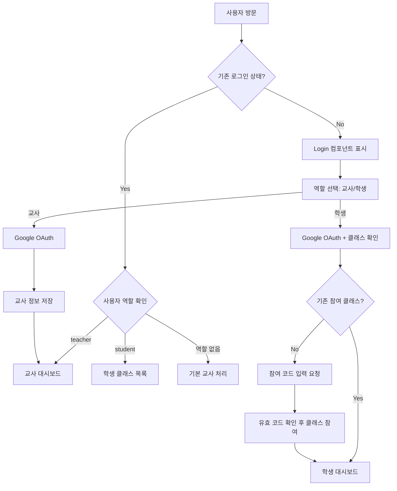

# 인증 및 라우팅 시스템 가이드 문서

## 📋 문서 개요

이 문서는 **상상력을 펼치는 글쓰기 V2** 프로젝트의 사용자 인증 시스템과 페이지 라우팅 메커니즘을 상세히 설명합니다. 교사와 학생을 구분하는 이중 인증 구조와 SPA(Single Page Application) 라우팅이 어떻게 동작하는지 비전문가도 이해할 수 있도록 설명합니다.

---

## 🎯 인증 시스템 개요

### 왜 복잡한 인증 시스템이 필요한가요?

**교육 플랫폼의 특별한 요구사항:**
1. **역할 구분**: 교사와 학생이 전혀 다른 권한과 기능을 가짐
2. **보안**: 학생은 오직 참여가 허가된 클래스에만 접근 가능
3. **편의성**: 복잡한 회원가입 없이 Google 계정으로 간편 로그인
4. **관리**: 교사가 학생 참여를 쉽게 관리할 수 있어야 함

### 인증 시스템 전체 흐름



---

## 🔐 Firebase Authentication 통합

### 1. Firebase Auth 초기화

```typescript
// src/lib/firebase/firebase.ts
import { getAuth } from 'firebase/auth';

export const auth = getAuth(app);

// 인증 상태 변화를 실시간으로 감지
auth.onAuthStateChanged((user) => {
  // 모든 컴포넌트가 이 변화를 감지할 수 있음
});
```

**Q: onAuthStateChanged는 어떻게 동작하나요?**
- **실시간 감지**: 로그인/로그아웃 상태를 즉시 감지
- **자동 토큰 갱신**: Firebase가 토큰 만료를 자동으로 처리
- **다중 탭 동기화**: 한 탭에서 로그인하면 다른 탭도 동기화
- **새로고침 지속성**: 페이지 새로고침 후에도 로그인 상태 유지

### 2. Google OAuth 구현

```typescript
// src/lib/components/Login.svelte
import { signInWithPopup, GoogleAuthProvider } from 'firebase/auth';

async function handleGoogleLogin() {
  try {
    const provider = new GoogleAuthProvider();
    const result = await signInWithPopup(auth, provider);
    
    // 사용자 정보 Firebase에서 자동 처리
    console.log('로그인 성공:', result.user.email);
    
  } catch (error) {
    console.error('로그인 실패:', error);
    // 사용자 친화적 에러 메시지 표시
  }
}
```

**Google OAuth의 장점:**
- **신뢰성**: 구글의 보안 인프라 활용
- **편의성**: 별도 비밀번호 기억 불필요
- **표준 준수**: OAuth 2.0 표준 프로토콜
- **교육 친화적**: 대부분의 학교가 Google Workspace 사용

---

## 👥 이중 역할 인증 시스템

### 1. 교사 인증 워크플로우

```typescript
// 교사용 Google 로그인 - 단순하고 직접적
async function handleGoogleLogin() {
  const provider = new GoogleAuthProvider();
  const result = await signInWithPopup(auth, provider);
  
  // 교사 정보를 Firestore에 저장
  await setDoc(doc(db, 'users', result.user.uid), {
    uid: result.user.uid,
    email: result.user.email,
    displayName: result.user.displayName,
    photoURL: result.user.photoURL,
    role: 'teacher',      // 핵심: 역할 명시
    points: 0,            // 게임화 요소 (향후 확장)
    level: 1,
    createdAt: serverTimestamp(),
    lastLogin: serverTimestamp()
  }, { merge: true });  // 기존 데이터와 병합
  
  // 즉시 대시보드로 이동
  window.location.href = '/dashboard';
}
```

**Q: 왜 merge: true를 사용하나요?**
- **데이터 보존**: 기존 사용자 정보(포인트, 레벨 등)를 덮어쓰지 않음
- **점진적 업데이트**: 새로운 필드만 추가하고 기존 필드는 유지
- **안전성**: 실수로 데이터를 잃을 위험 방지

### 2. 학생 인증 워크플로우 (2단계)

#### 1단계: Google 로그인 + 참여 이력 확인
```typescript
async function handleStudentGoogleLogin() {
  const provider = new GoogleAuthProvider();
  const result = await signInWithPopup(auth, provider);
  
  // 학생이 이미 어떤 클래스에 참여했는지 확인
  const membershipQuery = query(
    collection(db, 'classMembers'), 
    where('userId', '==', result.user.uid)
  );
  const membershipSnapshot = await getDocs(membershipQuery);
  
  if (!membershipSnapshot.empty) {
    // 기존 참여 클래스가 있음 → 바로 학생 페이지로
    await updateUserRole(result.user, 'student');
    window.location.href = '/student/classes';
  } else {
    // 참여 클래스가 없음 → 참여 코드 입력 요청
    showJoinCodeInput = true;
    errorMessage = '참여 코드를 입력해주세요.';
  }
}
```

#### 2단계: 참여 코드 검증 및 클래스 참여
```typescript
async function handleJoinWithCode(event: Event) {
  event.preventDefault();
  
  if (!joinCode.trim()) {
    errorMessage = '참여 코드를 입력해주세요.';
    return;
  }
  
  // 1. 참여 코드로 클래스 검색
  const classroomsRef = collection(db, 'classrooms');
  const q = query(classroomsRef, where('joinCode', '==', joinCode.toUpperCase()));
  const querySnapshot = await getDocs(q);
  
  if (querySnapshot.empty) {
    errorMessage = '존재하지 않는 참여 코드입니다.';
    return;
  }
  
  // 2. 유효한 클래스 발견 → 참여 처리 페이지로 이동
  const classDoc = querySnapshot.docs[0];
  window.location.href = `/join/${classDoc.id}`;
}
```

**Q: 왜 참여 코드를 대문자로 변환하나요?**
- **사용자 편의**: 대소문자 구분 없이 입력 가능
- **일관성**: 모든 참여 코드를 대문자로 통일
- **가독성**: QR 코드와 수기 입력 시 혼동 방지

---

## 🗂️ 사용자 데이터 구조

### 1. users 컬렉션 스키마

```typescript
// Firestore의 users 컬렉션 문서 구조
interface UserDocument {
  uid: string;                    // Firebase Auth UID
  email: string;                  // Google 계정 이메일
  displayName: string;            // 사용자 표시 이름
  photoURL?: string;              // 프로필 사진 URL
  role: 'teacher' | 'student';    // 핵심 역할 구분자
  
  // 게임화 요소 (향후 확장)
  points: number;                 // 현재 포인트
  level: number;                  // 현재 레벨
  achievements?: string[];        // 달성한 업적들
  
  // 메타 정보
  createdAt: Timestamp;          // 계정 생성일
  lastLogin: Timestamp;          // 마지막 로그인
  isActive?: boolean;            // 활성화 상태
}
```

### 2. classMembers 컬렉션 스키마

```typescript
// 클래스 참여 관계를 관리하는 별도 컬렉션
interface ClassMemberDocument {
  id: string;                    // 자동 생성 문서 ID
  classId: string;               // 참여한 클래스 ID
  userId: string;                // 학생 사용자 UID
  
  // 중복 저장된 정보 (성능 최적화)
  studentName: string;           // 학생 이름
  studentEmail: string;          // 학생 이메일
  className: string;             // 클래스 이름
  
  // 참여 메타 정보
  joinedAt: Timestamp;           // 참여일
  joinMethod: 'code' | 'qr';     // 참여 방식
  isActive: boolean;             // 활성 참여 상태
}
```

**Q: 왜 별도의 classMembers 컬렉션이 필요한가요?**
- **다대다 관계**: 한 학생이 여러 클래스에, 한 클래스에 여러 학생이 참여 가능
- **효율적 쿼리**: "학생의 모든 클래스" 또는 "클래스의 모든 학생"을 빠르게 조회
- **권한 관리**: 특정 학생의 특정 클래스 접근 권한을 쉽게 확인
- **확장성**: 향후 역할 세분화(조장, 부조장 등) 시 활용 가능

---

## 🛣️ SPA 라우팅 시스템

### 1. SvelteKit 파일 기반 라우팅

```
📁 src/routes/
├── +layout.svelte              # 모든 페이지의 공통 레이아웃
├── +page.svelte                # "/" - 메인 라우팅 허브
├── dashboard/
│   └── +page.svelte            # "/dashboard" - 교사 대시보드
├── student/
│   └── classes/
│       └── +page.svelte        # "/student/classes" - 학생 클래스 목록
├── class/
│   └── [id]/
│       └── +page.svelte        # "/class/[id]" - 특정 클래스 관리
├── lessons/
│   └── [id]/
│       └── +page.svelte        # "/lessons/[id]" - 특정 수업 상세
└── join/
    └── [classId]/
        └── +page.svelte        # "/join/[classId]" - 클래스 참여 페이지
```

**파일 기반 라우팅의 장점:**
- **직관적**: 폴더 구조가 URL 구조와 일치
- **자동화**: 별도 라우팅 설정 불필요
- **타입 안전**: TypeScript와 완벽 통합
- **SEO 친화적**: 각 페이지가 고유 URL을 가짐

### 2. 동적 라우팅 ([id], [classId])

```typescript
// src/routes/class/[id]/+page.svelte
import { page } from '$app/stores';

// URL에서 동적 매개변수 추출
$: classId = $page.params.id;

onMount(async () => {
  // 클래스 ID로 클래스 정보 조회
  const classDoc = await getDoc(doc(db, 'classrooms', classId));
  if (classDoc.exists()) {
    classData = classDoc.data();
  } else {
    // 존재하지 않는 클래스 → 404 처리
    goto('/dashboard');
  }
});
```

**Q: $page.params는 어떻게 동작하나요?**
- **자동 파싱**: SvelteKit이 URL을 자동으로 파싱하여 매개변수 추출
- **반응성**: URL이 변경되면 자동으로 컴포넌트 업데이트
- **타입 안전**: TypeScript에서 매개변수 타입 추론
- **유효성 검사**: 잘못된 ID 접근 시 적절한 오류 처리

---

## 🔒 접근 제어 및 권한 관리

### 1. 페이지 레벨 인증 가드

```typescript
// 모든 보호된 페이지의 공통 패턴
onMount(() => {
  const unsubscribe = auth.onAuthStateChanged(async (user) => {
    if (!user) {
      // 로그인되지 않음 → 홈페이지로 리디렉션
      goto('/');
      return;
    }
    
    // 추가 권한 검사 (필요시)
    const userDoc = await getDoc(doc(db, 'users', user.uid));
    const userRole = userDoc.data()?.role;
    
    if (requiredRole && userRole !== requiredRole) {
      // 권한 부족 → 적절한 페이지로 리디렉션
      goto(userRole === 'teacher' ? '/dashboard' : '/student/classes');
      return;
    }
    
    // 인증 및 권한 확인 완료
    isAuthenticated = true;
  });
  
  return unsubscribe;
});
```

### 2. 컴포넌트 레벨 권한 제어

```typescript
// Dashboard 컴포넌트 내부
async function deleteClass(classId: string) {
  // 1. 기본 인증 확인
  if (!user) {
    throw new Error('로그인이 필요합니다.');
  }
  
  // 2. 소유권 확인
  const classDoc = await getDoc(doc(db, 'classrooms', classId));
  if (classDoc.data()?.teacherId !== user.uid) {
    throw new Error('이 클래스를 삭제할 권한이 없습니다.');
  }
  
  // 3. 권한 확인 완료 → 실제 작업 수행
  await performClassDeletion(classId);
}
```

**다층 보안 접근법:**
- **클라이언트 검증**: 사용자 경험 향상을 위한 즉시 피드백
- **서버 검증**: Firebase Security Rules로 최종 권한 검증 (향후 구현)
- **데이터 검증**: 데이터 조작 시 추가 권한 확인

---

## 🔄 상태 기반 라우팅

### 1. 메인 라우팅 허브 (/+page.svelte)

```typescript
// 인증 상태에 따른 자동 라우팅
onMount(() => {
  return auth.onAuthStateChanged(async (currentUser) => {
    if (currentUser) {
      // 로그인된 사용자 → 역할 확인 후 적절한 페이지로
      const userRole = await getUserRole(currentUser.uid);
      
      if (userRole === 'teacher') {
        goto('/dashboard');
      } else if (userRole === 'student') {
        goto('/student/classes');
      } else {
        // 역할이 설정되지 않은 사용자 → 기본 교사로 처리
        await setUserRole(currentUser.uid, 'teacher');
        goto('/dashboard');
      }
    } else {
      // 로그인되지 않은 사용자 → Login 컴포넌트 표시
      // (자동 리디렉션 없이 현재 페이지에서 로그인 폼 표시)
    }
    
    isLoading = false;
  });
});
```

### 2. 조건부 컴포넌트 렌더링

```svelte
<!-- 인증 상태에 따른 조건부 렌더링 -->
<main>
  {#if isLoading}
    <LoadingScreen />
  {:else if user && userRole === 'teacher'}
    <Dashboard />
  {:else if user && userRole === 'student'}
    <div class="student-redirect">
      <p>학생 페이지로 이동 중입니다...</p>
      <a href="/student/classes">내 클래스 보기</a>
    </div>
  {:else}
    <Login />
  {/if}
</main>
```

**Q: 왜 학생도 메인 페이지에서 리디렉션 처리하나요?**
- **일관성**: 모든 사용자가 동일한 진입점을 가짐
- **안전성**: 직접 URL 접근 시에도 올바른 페이지로 이동
- **유연성**: 향후 학생용 메인 페이지 추가 시 쉽게 변경 가능

---

## 🎯 클래스 참여 메커니즘

### 1. QR 코드 기반 참여

```typescript
// QR 코드 생성 (Dashboard 컴포넌트)
async function createClass() {
  // 1. 클래스 기본 정보로 Firestore 문서 생성
  const docRef = await addDoc(collection(db, 'classrooms'), classData);
  
  // 2. 생성된 문서 ID로 참여 URL 생성
  const joinUrl = `${window.location.origin}/join/${docRef.id}`;
  
  // 3. QR 코드 생성
  const qrCodeDataUrl = await QRCode.toDataURL(joinUrl, {
    width: 256,
    margin: 2,
    color: { dark: '#1f2937', light: '#ffffff' }
  });
  
  // 4. QR 코드 정보를 클래스 문서에 저장
  await updateDoc(docRef, {
    qrCode: joinUrl,
    qrCodeUrl: qrCodeDataUrl
  });
}
```

### 2. 참여 코드 기반 참여

```typescript
// 6자리 알파벳+숫자 조합 코드 생성
function generateJoinCode(): string {
  return Math.random().toString(36).substring(2, 8).toUpperCase();
}

// 참여 코드 검증
async function validateJoinCode(code: string): Promise<ClassroomData | null> {
  const q = query(
    collection(db, 'classrooms'), 
    where('joinCode', '==', code.toUpperCase()),
    where('allowJoin', '==', true)  // 참여 허용된 클래스만
  );
  
  const snapshot = await getDocs(q);
  return snapshot.empty ? null : snapshot.docs[0].data();
}
```

### 3. 클래스 참여 처리 (/join/[classId])

```typescript
// src/routes/join/[classId]/+page.svelte
onMount(async () => {
  const classId = $page.params.classId;
  const user = auth.currentUser;
  
  if (!user) {
    // 로그인되지 않음 → 로그인 후 다시 시도하도록 안내
    goto(`/?redirect=/join/${classId}`);
    return;
  }
  
  try {
    // 1. 클래스 존재 및 참여 가능 여부 확인
    const classDoc = await getDoc(doc(db, 'classrooms', classId));
    if (!classDoc.exists() || !classDoc.data().allowJoin) {
      throw new Error('참여할 수 없는 클래스입니다.');
    }
    
    // 2. 이미 참여한 클래스인지 확인
    const existingMembership = await getDocs(query(
      collection(db, 'classMembers'),
      where('classId', '==', classId),
      where('userId', '==', user.uid)
    ));
    
    if (!existingMembership.empty) {
      // 이미 참여한 클래스 → 바로 클래스 페이지로
      goto(`/class/${classId}`);
      return;
    }
    
    // 3. 새로운 참여 처리
    await addDoc(collection(db, 'classMembers'), {
      classId: classId,
      userId: user.uid,
      studentName: user.displayName,
      studentEmail: user.email,
      className: classDoc.data().className,
      joinedAt: serverTimestamp(),
      joinMethod: 'qr',  // 또는 'code'
      isActive: true
    });
    
    // 4. 사용자 역할을 학생으로 설정 (아직 설정되지 않은 경우)
    await updateUserRole(user.uid, 'student');
    
    // 5. 성공적으로 참여 → 클래스 페이지로 이동
    goto(`/class/${classId}`);
    
  } catch (error) {
    console.error('클래스 참여 실패:', error);
    errorMessage = error.message;
  }
});
```

---

## 🔍 라우팅 디버깅 및 모니터링

### 1. 라우팅 로그

```typescript
// 개발 환경에서 라우팅 상태 추적
import { dev } from '$app/environment';

if (dev) {
  // 페이지 변경 추적
  page.subscribe((currentPage) => {
    console.log('Route changed:', {
      url: currentPage.url.pathname,
      params: currentPage.params,
      user: auth.currentUser?.email,
      timestamp: new Date().toISOString()
    });
  });
  
  // 인증 상태 변경 추적
  auth.onAuthStateChanged((user) => {
    console.log('Auth state changed:', {
      user: user ? user.email : 'anonymous',
      uid: user?.uid,
      timestamp: new Date().toISOString()
    });
  });
}
```

### 2. 에러 처리 및 폴백

```typescript
// 잘못된 라우팅 처리
onMount(async () => {
  try {
    // 페이지별 필수 데이터 로드
    await loadRequiredData();
  } catch (error) {
    console.error('Page load failed:', error);
    
    // 사용자 역할에 따른 안전한 폴백 페이지
    const user = auth.currentUser;
    if (user) {
      const userDoc = await getDoc(doc(db, 'users', user.uid));
      const role = userDoc.data()?.role;
      
      if (role === 'teacher') {
        goto('/dashboard');
      } else if (role === 'student') {
        goto('/student/classes');
      } else {
        goto('/');
      }
    } else {
      goto('/');
    }
  }
});
```

---

## ⚡ 성능 최적화

### 1. 라우팅 지연 로딩

```typescript
// 페이지별 조건부 컴포넌트 로드
{#if currentRoute === 'dashboard'}
  {#await import('$lib/components/Dashboard.svelte') then { default: Dashboard }}
    <Dashboard />
  {:catch}
    <ErrorMessage />
  {/await}
{/if}
```

### 2. 인증 상태 캐싱

```typescript
// 인증 상태를 메모리에 캐시하여 반복 확인 방지
let cachedUser: User | null = null;
let cacheTimestamp = 0;
const CACHE_DURATION = 5000; // 5초

async function getCachedUser(): Promise<User | null> {
  const now = Date.now();
  
  if (cachedUser && (now - cacheTimestamp) < CACHE_DURATION) {
    return cachedUser;
  }
  
  cachedUser = auth.currentUser;
  cacheTimestamp = now;
  return cachedUser;
}
```

### 3. 프리로딩 전략

```typescript
// 다음에 방문할 가능성이 높은 페이지 미리 로드
onMount(() => {
  if (userRole === 'teacher') {
    // 교사는 클래스 관리 페이지를 자주 방문
    import('$lib/components/ClassManagement.svelte');
  } else if (userRole === 'student') {
    // 학생은 활동 참여 페이지를 자주 방문
    import('$lib/components/StudentActivity.svelte');
  }
});
```

---

## 🛡️ 보안 고려사항

### 1. 클라이언트 사이드 보안

```typescript
// 민감한 데이터 접근 전 권한 재확인
async function accessSensitiveData(resourceId: string) {
  // 1. 기본 인증 확인
  const user = auth.currentUser;
  if (!user) {
    throw new Error('인증이 필요합니다.');
  }
  
  // 2. 세션 유효성 확인
  try {
    await user.getIdToken(true); // 토큰 강제 갱신
  } catch (error) {
    // 토큰이 유효하지 않음 → 재로그인 요구
    goto('/');
    return;
  }
  
  // 3. 리소스별 권한 확인
  const hasAccess = await checkResourceAccess(user.uid, resourceId);
  if (!hasAccess) {
    throw new Error('접근 권한이 없습니다.');
  }
  
  // 권한 확인 완료 → 데이터 접근 허용
}
```

### 2. URL 기반 공격 방지

```typescript
// 직접 URL 접근 시 권한 검증
onMount(async () => {
  const classId = $page.params.id;
  
  // 1. URL 매개변수 검증
  if (!/^[a-zA-Z0-9]{20}$/.test(classId)) {
    // Firestore 문서 ID 형식이 아님 → 404 처리
    goto('/404');
    return;
  }
  
  // 2. 리소스 존재 확인
  const classDoc = await getDoc(doc(db, 'classrooms', classId));
  if (!classDoc.exists()) {
    goto('/404');
    return;
  }
  
  // 3. 접근 권한 확인
  const user = auth.currentUser;
  const classData = classDoc.data();
  
  if (user?.uid !== classData.teacherId) {
    // 클래스 소유자가 아님 → 권한 없음
    goto('/unauthorized');
    return;
  }
  
  // 모든 검증 통과 → 페이지 로드 허용
});
```

---

## 📱 모바일 및 반응형 고려사항

### 1. 터치 기반 내비게이션

```svelte
<!-- 모바일 친화적 내비게이션 -->
<nav class="
  fixed bottom-0 left-0 right-0 
  bg-white border-t border-gray-200
  md:hidden  <!-- 데스크탑에서는 숨김 -->
">
  <div class="flex justify-around py-2">
    <a href="/dashboard" class="nav-item">
      <span class="text-2xl">🏠</span>
      <span class="text-xs">홈</span>
    </a>
    <a href="/classes" class="nav-item">
      <span class="text-2xl">📚</span>
      <span class="text-xs">클래스</span>
    </a>
  </div>
</nav>
```

### 2. 딥링크 처리

```typescript
// 모바일 앱에서 딥링크로 접근 시 처리
onMount(() => {
  const urlParams = new URLSearchParams(window.location.search);
  const deepLink = urlParams.get('redirect');
  
  if (deepLink && auth.currentUser) {
    // 로그인 상태에서 딥링크 접근 → 해당 페이지로 이동
    goto(deepLink);
  }
});
```

---

## 🔄 상태 동기화 및 일관성

### 1. 다중 탭 동기화

```typescript
// 여러 탭에서 동일한 앱 사용 시 상태 동기화
onMount(() => {
  // Firebase Auth는 자동으로 다중 탭 동기화 지원
  const unsubscribe = auth.onAuthStateChanged((user) => {
    // 다른 탭에서 로그인/로그아웃 시 현재 탭도 자동 업데이트
    if (!user && $page.url.pathname !== '/') {
      goto('/');
    }
  });
  
  return unsubscribe;
});
```

### 2. 오프라인 상태 처리

```typescript
// 네트워크 상태에 따른 라우팅 제한
let isOnline = true;

onMount(() => {
  isOnline = navigator.onLine;
  
  window.addEventListener('online', () => {
    isOnline = true;
    // 온라인 복구 시 필요한 데이터 재동기화
    location.reload();
  });
  
  window.addEventListener('offline', () => {
    isOnline = false;
    // 오프라인 모드 안내
  });
});

// 오프라인 상태에서 제한적 기능 제공
{#if !isOnline}
  <div class="offline-banner">
    오프라인 모드입니다. 일부 기능이 제한됩니다.
  </div>
{/if}
```

---

## ⚠️ 주의사항 및 베스트 프랙티스

### 1. 인증 상태 확인 타이밍

```typescript
// ❌ 잘못된 패턴: 즉시 인증 상태 확인
const user = auth.currentUser;
if (user) {
  // 페이지 로드 시 user가 null일 수 있음 (Firebase 초기화 전)
}

// ✅ 올바른 패턴: 인증 상태 리스너 사용
onMount(() => {
  const unsubscribe = auth.onAuthStateChanged((user) => {
    // Firebase 초기화 완료 후 정확한 인증 상태
    if (user) {
      // 안전한 인증 상태 기반 로직
    }
  });
  
  return unsubscribe;
});
```

### 2. 메모리 누수 방지

```typescript
// Firebase 리스너는 반드시 정리해야 함
let unsubscribes: (() => void)[] = [];

onMount(() => {
  const authUnsub = auth.onAuthStateChanged(handleAuthChange);
  const dataUnsub = onSnapshot(collection(db, 'data'), handleDataChange);
  
  unsubscribes = [authUnsub, dataUnsub];
});

onDestroy(() => {
  // 컴포넌트 제거 시 모든 리스너 정리
  unsubscribes.forEach(unsub => unsub());
});
```

### 3. 라우팅 가드 일관성

```typescript
// 모든 보호된 페이지에 일관된 가드 적용
export function createAuthGuard(requiredRole?: 'teacher' | 'student') {
  return (node: HTMLElement) => {
    const unsubscribe = auth.onAuthStateChanged(async (user) => {
      if (!user) {
        goto('/');
        return;
      }
      
      if (requiredRole) {
        const userDoc = await getDoc(doc(db, 'users', user.uid));
        if (userDoc.data()?.role !== requiredRole) {
          goto('/unauthorized');
        }
      }
    });
    
    return { destroy: unsubscribe };
  };
}
```

---

## 📚 추가 학습 자료

1. **Firebase Auth 가이드**: https://firebase.google.com/docs/auth/web/start
2. **SvelteKit 라우팅**: https://kit.svelte.dev/docs/routing
3. **Google OAuth 2.0**: https://developers.google.com/identity/protocols/oauth2
4. **SPA 보안 베스트 프랙티스**: https://owasp.org/www-project-top-ten/

---

**이 가이드는 프로젝트의 인증 및 라우팅 시스템을 이해하고 관리하는 데 도움이 되도록 작성되었습니다. 새로운 페이지나 인증 기능을 추가할 때 이 문서의 패턴을 참조하여 일관된 보안과 사용자 경험을 유지해주세요.**