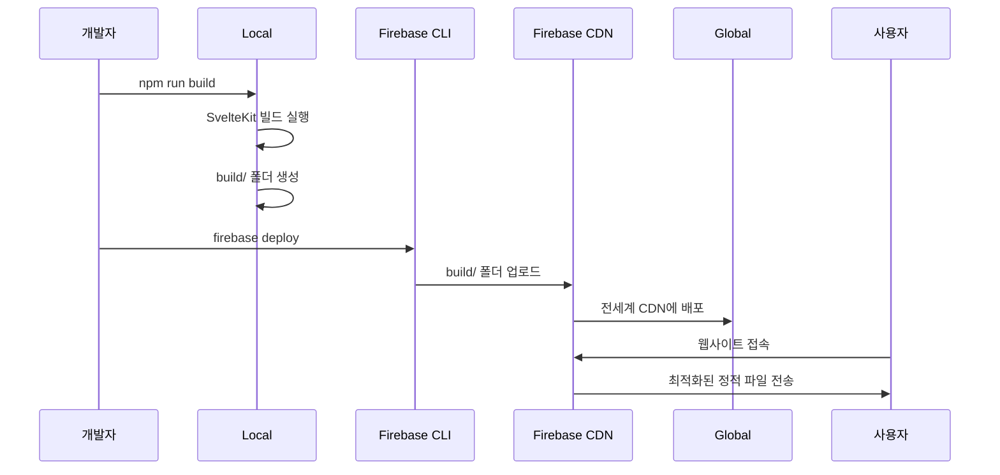

# 빌드 및 배포 시스템 가이드 문서

## 📋 문서 개요

이 문서는 **상상력을 펼치는 글쓰기 V2** 프로젝트의 빌드 시스템과 배포 프로세스를 상세히 설명합니다. SvelteKit 빌드 메커니즘, Firebase 호스팅 배포, 개발/프로덕션 환경 관리, CI/CD 파이프라인 등을 비전문가도 이해할 수 있도록 설명합니다.

---

## 🎯 빌드 시스템 개요

### 빌드란 무엇인가요?

**빌드**는 개발자가 작성한 소스 코드를 사용자가 실제로 사용할 수 있는 형태로 변환하는 과정입니다:

- **컴파일**: TypeScript → JavaScript 변환
- **번들링**: 여러 파일을 하나의 파일로 합치기
- **최적화**: 코드 압축, 불필요한 코드 제거
- **자산 처리**: 이미지, CSS, 폰트 등 정적 파일 최적화

### 왜 빌드 과정이 필요한가요?

**교육 플랫폼의 특별한 요구사항:**
1. **성능**: 빠른 로딩 속도로 학습 경험 향상
2. **호환성**: 다양한 브라우저에서 동일한 동작 보장
3. **보안**: 소스 코드 난독화 및 최적화
4. **효율성**: 네트워크 사용량 최소화

---

## 🏗️ SvelteKit 빌드 아키텍처

### 1. 전체 빌드 파이프라인

```
📁 Source Code (src/)
├── routes/              # 페이지 라우트
├── lib/components/      # 재사용 컴포넌트
├── lib/firebase/        # Firebase 설정
└── app.html            # HTML 템플릿

        ↓ (SvelteKit + Vite 빌드)

📁 Build Output (build/)
├── index.html          # 메인 HTML (SPA 엔트리포인트)
├── _app/               # 애플리케이션 번들
│   ├── immutable/      # 캐시 가능한 정적 자산
│   │   ├── chunks/     # JavaScript 청크들
│   │   ├── assets/     # CSS, 이미지 등
│   │   └── pages/      # 페이지별 번들
│   └── version.json    # 빌드 버전 정보
├── robots.txt          # SEO 로봇 지시사항
└── favicon.ico         # 파비콘
```

### 2. 빌드 설정 파일들

#### A. svelte.config.js - SvelteKit 핵심 설정
```javascript
import adapter from '@sveltejs/adapter-static';
import { vitePreprocess } from '@sveltejs/vite-plugin-svelte';

const config = {
  // Svelte 컴파일러 전처리기
  preprocess: vitePreprocess(),
  
  kit: {
    // 정적 사이트 생성 어댑터
    adapter: adapter({
      pages: 'build',        // 빌드 출력 디렉토리
      assets: 'build',       // 정적 자산 디렉토리
      fallback: 'index.html', // SPA 폴백 페이지
      precompress: false,    // Gzip 사전 압축 비활성화
      strict: false          // 엄격한 사전 렌더링 비활성화
    })
  }
};
```

**Q: 왜 adapter-static을 사용하나요?**
- **SPA 구현**: 클라이언트 사이드 라우팅 지원
- **Firebase 호환성**: Firebase 호스팅과 완벽 호환
- **성능**: 정적 파일로 제공되어 빠른 로딩
- **확장성**: CDN을 통한 글로벌 배포 가능

#### B. vite.config.ts - 빌드 도구 설정
```typescript
import { sveltekit } from '@sveltejs/kit/vite';
import { defineConfig } from 'vite';

export default defineConfig({
  plugins: [sveltekit()],
  
  // 개발 서버 설정
  server: {
    port: 5173,
    host: true  // 네트워크 접근 허용
  },
  
  // 빌드 최적화 설정
  build: {
    target: 'es2015',      // 타겟 JavaScript 버전
    minify: 'terser',      // 코드 압축 방식
    sourcemap: false,      // 프로덕션에서 소스맵 비활성화
    rollupOptions: {
      output: {
        manualChunks: {
          // 라이브러리별 청크 분할
          'firebase': ['firebase/app', 'firebase/auth', 'firebase/firestore'],
          'svelte': ['svelte', '@sveltejs/kit']
        }
      }
    }
  },
  
  // 환경 변수 처리
  define: {
    __FIREBASE_CONFIG__: JSON.stringify(process.env.FIREBASE_CONFIG)
  }
});
```

#### C. tsconfig.json - TypeScript 설정
```json
{
  "extends": "./.svelte-kit/tsconfig.json",
  "compilerOptions": {
    "allowJs": true,                    // JavaScript 파일 허용
    "checkJs": true,                    // JS 파일도 타입 체크
    "esModuleInterop": true,           // CommonJS 호환성
    "forceConsistentCasingInFileNames": true,  // 파일명 대소문자 엄격 검사
    "resolveJsonModule": true,          // JSON 파일 import 허용
    "skipLibCheck": true,               // 라이브러리 타입 체크 스킵
    "sourceMap": true,                  // 디버깅용 소스맵 생성
    "strict": true,                     // 엄격한 타입 체크
    "moduleResolution": "bundler"       // 번들러 모듈 해석
  }
}
```

---

## ⚙️ 빌드 프로세스

### 1. 개발 빌드 (npm run dev)

```bash
# 개발 서버 시작
npm run dev

# 내부적으로 실행되는 명령
vite dev
```

**개발 빌드의 특징:**
- **빠른 시작**: 빌드 없이 바로 개발 서버 실행
- **핫 리로드**: 코드 변경 시 자동 새로고침
- **소스맵**: 디버깅을 위한 원본 코드 매핑
- **개발 도구**: Vue DevTools, 에러 오버레이 등


### 2. 프로덕션 빌드 (npm run build)

```bash
# 프로덕션 빌드
npm run build

# 내부적으로 실행되는 과정
1. svelte-kit sync      # 타입 및 라우트 생성
2. vite build          # 실제 빌드 실행
3. adapter-static      # SPA 설정 적용
```

**빌드 단계별 상세 과정:**

#### 1단계: Svelte 컴파일
```typescript
// src/lib/components/Login.svelte
<script lang="ts">
  let name = 'World';
</script>
<h1>Hello {name}!</h1>

// ↓ 컴파일 후 (간소화된 예시)
import { create_component, safe_not_equal } from 'svelte/internal';

function create_fragment(ctx) {
  return {
    c() { /* DOM 생성 코드 */ },
    m() { /* DOM 마운트 코드 */ },
    p() { /* 업데이트 코드 */ },
    d() { /* 정리 코드 */ }
  };
}

class Login extends SvelteComponent {
  constructor(options) {
    super();
    init(this, options, instance, create_fragment, safe_not_equal, {});
  }
}
```

#### 2단계: TypeScript 컴파일
```typescript
// 개발 코드
interface User {
  uid: string;
  email: string;
  role: 'teacher' | 'student';
}

const user: User = getCurrentUser();

// ↓ JavaScript로 컴파일
const user = getCurrentUser();
```

#### 3단계: 번들링 및 청크 분할
```
📁 Build Chunks
├── app-abc123.js         # 메인 애플리케이션 코드
├── firebase-def456.js    # Firebase 관련 코드 
├── vendor-ghi789.js      # 서드파티 라이브러리들
├── login-jkl012.js       # Login 컴포넌트 (동적 로딩)
└── dashboard-mno345.js   # Dashboard 컴포넌트 (동적 로딩)
```

#### 4단계: 자산 최적화
```bash
# CSS 최적화
src/app.css (10KB) → build/_app/assets/app-abc123.css (3KB, minified)

# 이미지 최적화  
src/lib/assets/logo.png (100KB) → build/logo-def456.png (45KB, optimized)

# 폰트 최적화
Noto Sans KR → 사용된 글리프만 포함하여 크기 감소
```

### 3. 빌드 결과 분석

```bash
# 빌드 완료 후 출력 예시
✓ built in 45s

dist/
├── index.html                 2.1 kB │ gzip:  0.8 kB
├── assets/
│   ├── index-4f7d8c2e.js    127.3 kB │ gzip: 45.2 kB  # 메인 번들
│   ├── firebase-8a9b0c1d.js  89.7 kB │ gzip: 28.1 kB  # Firebase
│   ├── vendor-2e3f4g5h.js    245.1 kB │ gzip: 87.3 kB  # 라이브러리들
│   └── index-6i7j8k9l.css     12.4 kB │ gzip:  3.2 kB  # 스타일
└── (other static assets)
```

**번들 크기 최적화 팁:**
- **트리 셰이킹**: 사용되지 않는 코드 자동 제거
- **청크 분할**: 초기 로딩 시간 단축
- **레이지 로딩**: 필요할 때만 컴포넌트 로드
- **압축**: Gzip/Brotli 압축으로 전송량 감소

---

## 🚀 Firebase 호스팅 배포

### 1. Firebase 호스팅 설정

#### A. firebase.json 설정 파일
```json
{
  "hosting": {
    "public": "build",                    # 빌드 출력 디렉토리
    "ignore": [
      "firebase.json",
      "**/.*",
      "**/node_modules/**"
    ],
    "rewrites": [                         # SPA 라우팅 지원
      {
        "source": "**",                   # 모든 요청을
        "destination": "/index.html"      # index.html로 리다이렉트
      }
    ],
    "headers": [                          # HTTP 헤더 설정
      {
        "source": "/_app/immutable/**",
        "headers": [
          {
            "key": "Cache-Control",
            "value": "public, max-age=31536000, immutable"
          }
        ]
      },
      {
        "source": "**/*.@(js|css)",
        "headers": [
          {
            "key": "Cache-Control", 
            "value": "public, max-age=86400"
          }
        ]
      }
    ]
  }
}
```

**Q: 왜 rewrites 설정이 필요한가요?**
- **SPA 라우팅**: 클라이언트 사이드 라우팅을 서버에서 지원
- **직접 URL 접근**: `/dashboard` 등의 URL로 직접 접근 가능
- **새로고침 지원**: 페이지 새로고침 시에도 올바른 내용 표시
- **SEO**: 검색 엔진이 각 페이지를 개별 URL로 인식

#### B. 캐싱 전략
```
📁 캐싱 계층 구조
├── immutable/ (1년 캐싱)     # 해시가 포함된 파일들
│   ├── chunks/app-abc123.js  # 내용이 바뀌면 해시도 변경
│   └── assets/style-def456.css
├── assets/ (1일 캐싱)        # 일반 정적 자산
│   ├── logo.png
│   └── favicon.ico
└── index.html (캐싱 없음)    # 항상 최신 버전 제공
```

### 2. 배포 프로세스

#### A. 수동 배포
```bash
# 1. 프로덕션 빌드
npm run build

# 2. 빌드 결과 확인
ls -la build/

# 3. Firebase 배포 미리보기 (선택사항)
firebase hosting:channel:deploy preview --expires 1h

# 4. 프로덕션 배포
firebase deploy --only hosting

# 배포 성공 메시지
✔ Deploy complete!

Project Console: https://console.firebase.google.com/project/improvewriting-v2
Hosting URL: https://improvewriting-v2.web.app
```

#### B. 배포 단계별 과정



#### C. 배포 확인 및 롤백
```bash
# 배포 히스토리 확인
firebase hosting:releases:list

# 이전 버전으로 롤백
firebase hosting:releases:rollback

# 특정 버전으로 롤백
firebase hosting:releases:rollback --release-id abc123
```

### 3. 도메인 및 SSL 설정

#### A. 커스텀 도메인 연결
```bash
# 커스텀 도메인 추가
firebase hosting:sites:create improvewriting-custom
firebase target:apply hosting production improvewriting-custom

# DNS 설정 확인
firebase hosting:channel:list
```

#### B. 자동 SSL 인증서
Firebase 호스팅은 자동으로 Let's Encrypt SSL 인증서를 제공:
- **자동 갱신**: 인증서 만료 전 자동 갱신
- **다중 도메인**: 여러 도메인에 대한 SSL 지원
- **HTTP/2**: 성능 향상을 위한 HTTP/2 지원

---

## 🌍 환경 관리

### 1. 개발/프로덕션 환경 분리

#### A. 환경별 Firebase 프로젝트
```bash
# 개발 환경
firebase use development
firebase deploy --only hosting

# 프로덕션 환경  
firebase use production
firebase deploy --only hosting
```

#### B. 환경 변수 관리
```typescript
// src/lib/config/environment.ts
export const ENV = {
  NODE_ENV: import.meta.env.MODE,
  DEV: import.meta.env.DEV,
  PROD: import.meta.env.PROD,
  
  // Firebase 설정 (환경별 다른 값)
  FIREBASE_CONFIG: import.meta.env.DEV 
    ? developmentFirebaseConfig 
    : productionFirebaseConfig,
    
  // API 엔드포인트
  API_BASE_URL: import.meta.env.DEV 
    ? 'http://localhost:5000' 
    : 'https://api.improvewriting.com',
    
  // 디버깅 설정
  ENABLE_DEBUG: import.meta.env.DEV,
  ENABLE_ANALYTICS: import.meta.env.PROD
};
```

#### C. 조건부 기능 로딩
```typescript
// Firebase Analytics 조건부 로딩
if (ENV.PROD && typeof window !== 'undefined') {
  import('firebase/analytics').then(({ getAnalytics, logEvent }) => {
    const analytics = getAnalytics(app);
    logEvent(analytics, 'page_view');
  });
}

// 개발 환경 전용 디버깅 도구
if (ENV.DEV) {
  import('./debug-tools').then(({ initDebugTools }) => {
    initDebugTools();
  });
}
```

### 2. Feature Flags 및 A/B 테스팅

```typescript
// src/lib/config/features.ts
export const FEATURES = {
  // Firebase Remote Config에서 관리
  ENABLE_NEW_DASHBOARD: false,
  ENABLE_AI_FEEDBACK: true,
  MAX_CLASS_SIZE: 50,
  
  // 사용자 그룹별 기능
  TEACHER_FEATURES: {
    ADVANCED_ANALYTICS: true,
    BULK_OPERATIONS: true
  },
  
  STUDENT_FEATURES: {
    PORTFOLIO_SHARING: false,
    PEER_FEEDBACK: true
  }
};

// 컴포넌트에서 사용
{#if FEATURES.ENABLE_NEW_DASHBOARD}
  <NewDashboard />
{:else}
  <LegacyDashboard />
{/if}
```

---

## 🔧 고급 빌드 최적화

### 1. 번들 분석 및 최적화

#### A. 번들 분석 도구
```bash
# 번들 크기 분석
npm install -D rollup-plugin-visualizer

# vite.config.ts에 플러그인 추가
import { visualizer } from 'rollup-plugin-visualizer';

export default defineConfig({
  plugins: [
    sveltekit(),
    visualizer({
      filename: 'bundle-analysis.html',
      open: true,
      gzipSize: true
    })
  ]
});
```

#### B. 동적 import를 통한 코드 분할
```typescript
// 대용량 라이브러리 동적 로딩
async function generateQRCode(data: string) {
  const { default: QRCode } = await import('qrcode');
  return QRCode.toDataURL(data);
}

// 조건부 컴포넌트 로딩
{#await import('$lib/components/AdvancedChart.svelte') then { default: AdvancedChart }}
  <AdvancedChart {data} />
{:catch}
  <SimpleChart {data} />
{/await}
```

### 2. 성능 최적화 기법

#### A. 프리로딩 전략
```typescript
// 중요한 페이지 미리 로드
onMount(() => {
  if (userRole === 'teacher') {
    // 교사는 클래스 관리 페이지를 자주 사용
    import('$lib/components/ClassManagement.svelte');
  }
});

// 마우스 호버 시 프리로드
<a 
  href="/dashboard" 
  on:mouseenter={() => import('/routes/dashboard/+page.svelte')}
>
  대시보드
</a>
```

#### B. 이미지 최적화
```typescript
// 반응형 이미지 로딩
<picture>
  <source 
    media="(min-width: 768px)" 
    srcset="/images/hero-large.webp"
  >
  <source 
    media="(max-width: 767px)" 
    srcset="/images/hero-small.webp"
  >
  
</picture>
```

### 3. Service Worker 및 PWA

```javascript
// static/service-worker.js
const CACHE_NAME = 'improve-writing-v1';
const urlsToCache = [
  '/',
  '/dashboard',
  '/_app/immutable/chunks/index.js',
  '/_app/immutable/assets/app.css'
];

self.addEventListener('install', (event) => {
  event.waitUntil(
    caches.open(CACHE_NAME)
      .then((cache) => cache.addAll(urlsToCache))
  );
});

self.addEventListener('fetch', (event) => {
  event.respondWith(
    caches.match(event.request)
      .then((response) => {
        return response || fetch(event.request);
      }
    )
  );
});
```

---

## 🤖 CI/CD 자동화

### 1. GitHub Actions 워크플로우

```yaml
# .github/workflows/deploy.yml
name: Deploy to Firebase

on:
  push:
    branches: [main]
  pull_request:
    branches: [main]

jobs:
  build-and-deploy:
    runs-on: ubuntu-latest
    
    steps:
    - name: Checkout code
      uses: actions/checkout@v3
      
    - name: Setup Node.js
      uses: actions/setup-node@v3
      with:
        node-version: '18'
        cache: 'npm'
        
    - name: Install dependencies
      run: npm ci
      
    - name: Run type check
      run: npm run check
      
    - name: Run tests
      run: npm test
      
    - name: Build project
      run: npm run build
      
    - name: Deploy to Firebase (Preview)
      if: github.event_name == 'pull_request'
      uses: FirebaseExtended/action-hosting-deploy@v0
      with:
        repoToken: '${{ secrets.GITHUB_TOKEN }}'
        firebaseServiceAccount: '${{ secrets.FIREBASE_SERVICE_ACCOUNT_DEV }}'
        channelId: preview
        projectId: improvewriting-dev
        
    - name: Deploy to Firebase (Production)
      if: github.ref == 'refs/heads/main'
      uses: FirebaseExtended/action-hosting-deploy@v0
      with:
        repoToken: '${{ secrets.GITHUB_TOKEN }}'
        firebaseServiceAccount: '${{ secrets.FIREBASE_SERVICE_ACCOUNT_PROD }}'
        channelId: live
        projectId: improvewriting-prod
```

### 2. 자동 테스팅

```typescript
// tests/integration/build.test.ts
import { test, expect } from '@playwright/test';

test('build output validation', async () => {
  // 빌드된 파일들이 존재하는지 확인
  expect(await fs.access('build/index.html')).toBeTruthy();
  expect(await fs.access('build/_app')).toBeTruthy();
  
  // HTML 파일이 올바른 구조를 갖는지 확인
  const html = await fs.readFile('build/index.html', 'utf8');
  expect(html).toContain('<title>상상력을 펼치는 글쓰기</title>');
  expect(html).toContain('_app/immutable');
});

test('deployment smoke test', async ({ page }) => {
  // 실제 배포된 사이트 테스트
  await page.goto('https://improvewriting-v2.web.app');
  
  // 주요 기능들이 작동하는지 확인
  await expect(page.locator('h1')).toContainText('상상력을 펼치며 글쓰기');
  await page.click('button:has-text("교사")');
  await expect(page.locator('button:has-text("Google 계정으로 로그인")')).toBeVisible();
});
```

---

## 📊 성능 모니터링

### 1. 빌드 성능 추적

```typescript
// scripts/build-stats.js
import fs from 'fs';
import path from 'path';

function analyzeBuildOutput() {
  const buildDir = 'build';
  const stats = {
    totalSize: 0,
    fileCount: 0,
    largestFiles: [],
    chunkSizes: {}
  };
  
  function scanDirectory(dir) {
    const files = fs.readdirSync(dir);
    
    files.forEach(file => {
      const filePath = path.join(dir, file);
      const stat = fs.statSync(filePath);
      
      if (stat.isDirectory()) {
        scanDirectory(filePath);
      } else {
        stats.totalSize += stat.size;
        stats.fileCount++;
        
        if (stat.size > 100000) { // 100KB 이상 파일 추적
          stats.largestFiles.push({
            file: filePath,
            size: stat.size
          });
        }
      }
    });
  }
  
  scanDirectory(buildDir);
  
  // 결과를 JSON 파일로 저장
  fs.writeFileSync('build-stats.json', JSON.stringify(stats, null, 2));
  
  console.log(`빌드 완료: ${stats.fileCount}개 파일, 총 ${(stats.totalSize / 1024 / 1024).toFixed(2)}MB`);
}

analyzeBuildOutput();
```

### 2. 런타임 성능 모니터링

```typescript
// src/lib/utils/performance.ts
export class PerformanceMonitor {
  private static metrics: Map<string, number[]> = new Map();
  
  static startTiming(label: string): string {
    const id = `${label}_${Date.now()}`;
    performance.mark(`${id}_start`);
    return id;
  }
  
  static endTiming(id: string, label: string) {
    performance.mark(`${id}_end`);
    performance.measure(id, `${id}_start`, `${id}_end`);
    
    const measure = performance.getEntriesByName(id)[0];
    const duration = measure.duration;
    
    // 메트릭 수집
    if (!this.metrics.has(label)) {
      this.metrics.set(label, []);
    }
    this.metrics.get(label)!.push(duration);
    
    // Firebase Analytics로 전송 (프로덕션에서만)
    if (ENV.PROD && window.gtag) {
      window.gtag('event', 'timing_complete', {
        name: label,
        value: Math.round(duration)
      });
    }
  }
  
  static getMetrics() {
    const result = {};
    this.metrics.forEach((values, key) => {
      result[key] = {
        avg: values.reduce((a, b) => a + b, 0) / values.length,
        min: Math.min(...values),
        max: Math.max(...values),
        count: values.length
      };
    });
    return result;
  }
}

// 사용 예시
const timingId = PerformanceMonitor.startTiming('firebase_auth');
await signInWithPopup(auth, provider);
PerformanceMonitor.endTiming(timingId, 'firebase_auth');
```

---

## ⚠️ 주의사항 및 베스트 프랙티스

### 1. 빌드 최적화

```typescript
// ❌ 잘못된 패턴: 모든 라이브러리를 메인 번들에 포함
import * as firebase from 'firebase/app';
import 'firebase/auth';
import 'firebase/firestore';

// ✅ 올바른 패턴: 필요한 기능만 import
import { initializeApp } from 'firebase/app';
import { getAuth, signInWithPopup } from 'firebase/auth';
import { getFirestore, collection } from 'firebase/firestore';
```

### 2. 환경 설정 관리

```typescript
// ❌ 하드코딩된 환경 설정
const apiUrl = 'https://api.improvewriting.com';

// ✅ 환경별 설정 관리
const apiUrl = import.meta.env.VITE_API_URL || 'http://localhost:5000';
```

### 3. 빌드 캐싱

```bash
# .gitignore에 빌드 관련 캐시 폴더 추가
build/
.svelte-kit/
node_modules/
dist/

# 하지만 package-lock.json은 커밋
!package-lock.json
```

### 4. 배포 전 체크리스트

- [ ] `npm run check` 타입 체크 통과
- [ ] `npm run build` 빌드 성공
- [ ] `npm run preview` 로컬 확인
- [ ] Firebase 환경 설정 확인
- [ ] 환경 변수 설정 확인
- [ ] 도메인 및 SSL 인증서 확인

---

## 🔍 트러블슈팅

### 1. 일반적인 빌드 에러

#### A. TypeScript 타입 에러
```bash
# 에러 메시지
error TS2307: Cannot find module '$lib/firebase/firebase'

# 해결방법
1. svelte-kit sync 실행으로 타입 재생성
2. tsconfig.json 경로 별칭 확인
3. 모듈 import 경로 수정
```

#### B. 메모리 부족 에러
```bash
# 에러 메시지  
FATAL ERROR: Reached heap limit allocation failed - JavaScript heap out of memory

# 해결방법
NODE_OPTIONS="--max-old-space-size=4096" npm run build
```

### 2. 배포 관련 문제

#### A. SPA 라우팅 동작 안함
```bash
# 증상: 직접 URL 접근 시 404 에러

# 해결방법: firebase.json의 rewrites 설정 확인
{
  "hosting": {
    "rewrites": [
      { "source": "**", "destination": "/index.html" }
    ]
  }
}
```

#### B. 정적 자산 로딩 실패
```bash
# 증상: CSS, JS 파일 404 에러

# 해결방법: vite.config.ts의 base URL 설정
export default defineConfig({
  base: '/',  // 또는 서브디렉토리 경로
});
```

---

## 📚 추가 학습 자료

1. **SvelteKit 문서**: https://kit.svelte.dev/docs
2. **Vite 빌드 가이드**: https://vitejs.dev/guide/build.html
3. **Firebase 호스팅**: https://firebase.google.com/docs/hosting
4. **Web.dev 성능 가이드**: https://web.dev/performance/
5. **GitHub Actions**: https://docs.github.com/en/actions

---

## 📋 배포 체크리스트

### 개발 환경 준비
- [ ] Node.js 18+ 설치 확인
- [ ] Firebase CLI 설치 및 로그인
- [ ] 환경 변수 설정 완료
- [ ] 개발 서버 정상 동작 확인

### 빌드 및 테스트
- [ ] `npm install` 의존성 설치
- [ ] `npm run check` 타입 체크 통과
- [ ] `npm run build` 빌드 성공
- [ ] `npm run preview` 로컬 미리보기 확인

### 배포 실행
- [ ] Firebase 프로젝트 선택 (`firebase use`)
- [ ] `firebase deploy --only hosting` 실행
- [ ] 배포 URL 접속 및 기능 테스트
- [ ] 모바일 반응형 확인

### 배포 후 확인
- [ ] 주요 페이지 동작 확인
- [ ] Google OAuth 로그인 테스트
- [ ] Firestore 연동 확인
- [ ] 성능 지표 모니터링 (PageSpeed Insights)

---

**이 가이드는 프로젝트의 빌드 및 배포 시스템을 이해하고 관리하는 데 도움이 되도록 작성되었습니다. 새로운 기능을 추가하거나 배포 프로세스를 개선할 때 이 문서의 패턴을 참조하여 안정적이고 효율적인 배포를 유지해주세요.**